# postgres.js vs node-postgres — Architecture & Flow Diagrams

## How to read this

The Mermaid diagrams in this document render natively on GitHub. Each subsystem is presented with two diagrams, one per library, so the two implementations can be compared side by side. Every diagram is grounded in the source of each library at the pinned versions.

## Contents

- Module & Component Architecture
- Connection Establishment & Socket Setup
- Startup & Authentication Handshake
- Extended Query Protocol (Parse/Bind/Describe/Execute/Sync)
- Simple Query Protocol & Multi-statement
- Wire Protocol: Framing, Parsing & Serialization
- Connection Pooling Lifecycle
- Type Serialization & Parsing Pipeline
- Prepared Statements & Statement Caching
- Cursors, Streaming & Backpressure
- COPY IN / COPY OUT
- LISTEN/NOTIFY & Logical Replication
- Errors, Teardown, Reconnect & Pipelining


## Module & Component Architecture

The two drivers make opposite packaging decisions. **postgres.js** is a single ESM `src/` of ~10 files (`2694` LOC total) with no runtime npm dependencies — it speaks the PostgreSQL wire protocol itself directly over `net`/`tls` (`connection.js:1-3`) and ships per-runtime re-bundles (`cf/`, `deno/`, `cjs/`) generated by `transpile.*.js`. **node-postgres** is a Lerna/npm monorepo where the `pg` facade (`pg/lib/index.js`) composes separately-versioned packages: `pg-protocol` (wire codec), `pg-pool`, `pg-connection-string`, `pg-types`, plus optional `pg-native`/`pg-cloudflare`/`pg-cursor`/`pg-query-stream`. postgres.js fuses pool + protocol + query-builder into one cohesive unit; node-postgres draws hard module boundaries with `EventEmitter`-based seams.

### postgres.js

The default export `Postgres()` (`index.js:49`) is a factory: it parses options, then eagerly allocates a fixed array of `options.max` `Connection` objects as the pool (`index.js:65`) and a set of `Queue()` instances (`index.js:55-63`) that track each connection's lifecycle state (`connecting`, `reserved`, `open`, `busy`, `full`, `closed`, `ended`). It builds the tagged-template `sql` function via `Sql(handler)` (`index.js:67,86-117`): a template literal produces a `Query` (a subclass of `Promise`, `query.js:6`), a bare string produces an `Identifier`, and an object produces a `Builder` (`index.js:110-116`).

- **`index.js`** — public API surface, option parsing, pool array, the `sql` tagged-template/`unsafe`/`begin`/`reserve`/`listen`/`end` methods, and the `handler` that routes queries onto connections.
- **`connection.js`** (largest, `1062` LOC) — owns one socket. Imports `net`, `tls`, `crypto`, `Stream` (`connection.js:1-5`) and implements the full frontend/backend protocol itself: builds outbound messages with `b` from `bytes.js` (`connection.js:12`), parses inbound bytes, runs SASL/SCRAM and MD5 auth, and writes rows into `Result`.
- **`query.js`** — `Query extends Promise` plus the `CLOSE` sentinel; carries the strings/args, the `handler`, and a `canceller`.
- **`types.js`** — value `stringify`/`handleValue`, array parser/serializer, `Parameter`/`Identifier`/`Builder` classes, type inference, and case transforms (`toCamel`, `pascal`, etc.); imported by both `index.js` and `connection.js`.
- **`bytes.js`** (`78` LOC) — a tiny growable write buffer (`b`) used to frame outbound protocol messages.
- **`result.js`** (`16` LOC) — `Result extends Array`, the row container.
- **`queue.js`** (`31` LOC) — minimal doubly-linked queue used for the pool state machine.
- **`subscribe.js`** — LISTEN/NOTIFY + logical replication (built lazily unless `no_subscribe`, `index.js:51`); imports nothing from peers except via the parent `sql`.
- **`large.js`** — large-object (lo) streaming over `Stream`, bound onto `sql` (`index.js:71`).
- **`errors.js`** — `Errors`/`PostgresError` constructors shared everywhere.

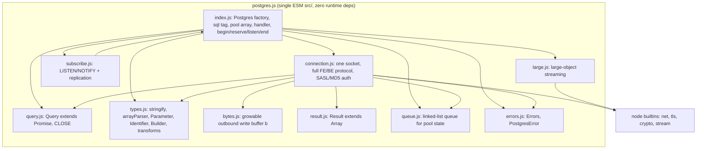

### node-postgres

`pg/lib/index.js` constructs a `PG` object (`index.js:21-35`) exposing `Client`, `Pool` (a `BoundPool extends Pool` from `pg-pool`, `index.js:13-18,25`), `types` (`pg-types`), `Connection`, `Result`, and helpers. `Client extends EventEmitter` (`client.js:50`) wires together `ConnectionParameters` (`client.js:54`, which itself parses via `pg-connection-string`), a `Connection` (`connection.js`), `TypeOverrides`, and SASL crypto (`client.js:1-11`). The raw `Connection` (`pg/lib/connection.js`) is the protocol seam: it requires `{ parse, serialize }` from **`pg-protocol`** (`connection.js:5`) and a `stream` (`pg/lib/stream.js`) that lazily picks `net`/`tls` or, on Cloudflare, `CloudflareSocket` from **`pg-cloudflare`** (`stream.js:22,27,41`). Native mode swaps the entire `Client` for `pg/lib/native` → **`pg-native`** → `libpq` when `NODE_PG_FORCE_NATIVE` is set (`index.js:39-48`, `native/index.js:2`, `pg-native/index.js:1`).

- **`pg` (facade)** — `index.js` assembles the public object; `client.js` orchestrates a connection's auth/query lifecycle; `query.js` is the per-query state (`Result`, row parsing) emitted over events; `result.js`, `type-overrides.js`, `utils.js`, `defaults.js`, `connection-parameters.js` are support modules; `connection.js` frames protocol I/O; `stream.js` abstracts the socket; `crypto/` does SASL/SCRAM.
- **`pg-protocol`** — pure wire codec: `parser.ts` (inbound `BackendMessage` stream), `serializer.ts` (`serialize` map of outbound frames), `messages.ts` (message types + `DatabaseError`), `buffer-reader.ts`/`buffer-writer.ts`. `index.ts` exports `parse`, `serialize`, `DatabaseError`.
- **`pg-pool`** — connection pool; subclassed by `pg`'s `BoundPool`.
- **`pg-connection-string`** — DSN parser used by `connection-parameters.js`.
- **`pg-types`** — OID → JS value parsers (exposed as `pg.types`).
- **Optional/peer:** `pg-native` (libpq binding), `pg-cloudflare` (Workers TCP socket), `pg-cursor` (server-side cursors), `pg-query-stream` (Readable stream; depends on `pg-cursor`).

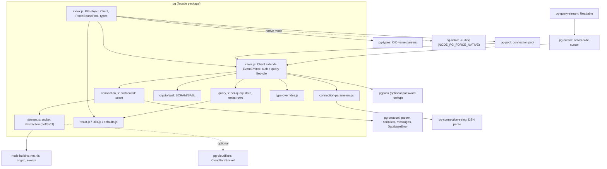

### Comparison and design takeaways for a new driver

- **Packaging:** postgres.js = one ESM tree, zero runtime deps, re-bundled per runtime (`cf/`, `deno/`, `cjs/`, `transpile.*.js`); node-postgres = independently-versioned monorepo packages glued by `require`. The monolith is far easier to reason about and tree-shake; the monorepo lets `pg-protocol`/`pg-types` be reused standalone but pays a coordination/version-skew tax (`pg` pins `pg-protocol ^1.15`, `pg-pool ^3.14`, etc.).
- **Protocol boundary:** node-postgres cleanly isolates the wire codec in `pg-protocol` (typed TS, unit-tested via `inbound-parser.test.ts`/`outbound-serializer.test.ts`) behind `parse`/`serialize`. postgres.js inlines all framing into `connection.js` with a hand-rolled `bytes.js` buffer — faster and dependency-free, but `connection.js` is a `1062`-line god-object mixing socket, auth, parsing, and result assembly. **Adopt node-postgres's separable, independently-testable codec; avoid postgres.js's monster connection file.**
- **Concurrency model:** postgres.js is async/await-native — `Query extends Promise` (`query.js:6`) and the pool is a fixed array driven by `Queue` state buckets (`index.js:55-65`). node-postgres is `EventEmitter`-callback-native (`Client`/`Connection`/`Query` all extend `EventEmitter`) with promise wrappers layered on top, plus several `pg@9` deprecations for legacy behaviors (`client.js:13-37`). **Prefer the promise-first design; the event seams in pg are a footgun (un-awaited queries, `activeQuery`/`queryQueue` deprecation churn).**
- **Socket abstraction:** node-postgres's `stream.js` lazily selecting `net`/`tls`/`CloudflareSocket` (`stream.js:22-41`) is a clean injection point for alternative runtimes; postgres.js instead ships whole rebuilt bundles per runtime. **Adopt a single pluggable socket interface rather than maintaining N transpiled copies.**
- **Native escape hatch:** node-postgres can swap the entire `Client` for libpq via `pg-native` (`index.js:39-48`) — useful but a maintenance burden and a different code path. postgres.js has none. A new driver should keep one pure-JS path and treat native as optional at most.
- **Type system:** both centralize OID parsing (`pg-types` vs `types.js`), but postgres.js bundles ergonomic helpers (case transforms, `Builder`, `Identifier`, tagged templates) into the same module, giving a richer query-construction API out of the box. **Adopt postgres.js's tagged-template + parameter-inference ergonomics on top of a pg-style modular codec.**

### Verification notes
Adversarially checked against real source. Both Mermaid diagrams render (valid `flowchart TD`, all special chars `->`/`()`/`=`/`:` are inside quoted labels, dotted `-.text.->` links are valid). LOC totals verified exactly: postgres.js src = 2694 total, connection.js = 1062, bytes.js = 78, result.js = 16, queue.js = 31. postgres.js citations verified: `Postgres()` factory at index.js:49, connections array at index.js:65, Queue() state buckets at index.js:55-63 (the separate `queries` queue at line 54 is correctly excluded from the connection-state set), `Sql(handler)` at index.js:67, `no_subscribe` at index.js:51, largeObject bind at index.js:71, `Query extends Promise` at query.js:6, connection.js imports net/tls/crypto/Stream at lines 1-5. node-postgres citations verified: PG object index.js:21-35, BoundPool index.js:13-18/25, native gate index.js:39-48, `Client extends EventEmitter` client.js:50, ConnectionParameters client.js:54, sasl/crypto imports client.js:1-11, pg@9 deprecations client.js:13-37, `{parse,serialize}` from pg-protocol at connection.js:5, stream runtime selection at stream.js:22/27/41, pg-native requires libpq at pg-native/index.js:1, version pins (pg-protocol ^1.15.0, pg-pool ^3.14.0) in pg/package.json. pg-protocol file/export inventory (parser/serializer/messages/buffer-reader/buffer-writer + index exporting parse/serialize/DatabaseError, plus inbound-parser.test.ts/outbound-serializer.test.ts) all confirmed.

Corrections applied:
1. (FIXED) node-postgres diagram had edge `pcparam --> pgpass`, but `pgpass` is NOT required by connection-parameters.js — `require('pgpass')` lives in client.js:294. Edge corrected to `pclient --> pgpass`. (connection-parameters.js only requires pg-connection-string at line 7.)

Minor imprecisions (left as-is, not materially wrong):
- Prose says `b` from bytes.js is imported at `connection.js:12`; the actual `import b from './bytes.js'` is line 11 (off by one).
- Native chain cite `native/index.js:2` points to `require('./client')`; the actual `require('pg-native')` is in native/client.js:7. The depicted chain pg/lib/native -> pg-native -> libpq is conceptually correct.
- Diagram edge `cursor --> pclient` is a conceptual/runtime relationship (a cursor is executed by being passed to `client.query()`); pg-cursor does not `require` Client. Acceptable as an architecture-level edge.


## Connection Establishment & Socket Setup

Both drivers resolve a config (object or connection URL) into host/port/ssl, create a raw `net.Socket`, and optionally upgrade it to TLS by writing an 8-byte `SSLRequest` (length `8`, code `80877103`) and inspecting the single-byte `S`/`N` reply before calling `tls.connect`. The key structural difference: postgres.js folds parsing, socket lifecycle, the SSL handshake, the protocol state machine, and pooling into one `Connection` closure (`src/connection.js`) created eagerly per pool slot, while node-postgres splits responsibilities across `ConnectionParameters` (parse), `Connection` (socket + SSL + protocol I/O), `stream.js` (runtime-specific socket factory), and `Client` (orchestration). Both now also support `sslnegotiation=direct` (immediate TLS, ALPN `postgresql`, skipping the SSLRequest round-trip). postgres.js natively handles comma-separated multi-host with round-robin failover; node-postgres delegates multi-host to the pool/caller.

### postgres.js

Entry is `Postgres(a, b)` (`src/index.js:49`). `parseOptions` (`index.js:430`) merges, in priority order, the options object, the URL parsed by `parseUrl` (`index.js:537`), `PG*` env vars, and defaults. Notable parsing facts:
- `parseUrl` (`index.js:537-559`) manually slices the authority out of the string to detect a comma-separated `multihost` before handing a single-host-normalized URL to the `URL` constructor — `URL` cannot parse `host1,host2`.
- host/port are normalized to arrays: `host.split(',')` and a parallel port array `host.split(',').map(x => parseInt(x.split(':')[1] || port))` (`index.js:466-467`). A unix socket `path` is derived when host contains `/`: `host + '/.s.PGSQL.' + port` (`index.js:468`).
- `sslmode` is aliased to `ssl` (`index.js:443`); `sslrootcert=system` becomes `ssl: 'verify-full'` (`index.js:445`). `ssl` default is `false` (`index.js:451`); string values `disable`/`false` become `false` (`index.js:475`).

The pool eagerly constructs `options.max` `Connection` closures up front (`index.js:65`). Each `Connection` (`connection.js:52`) holds one `socket`, a `connectTimer`, and a `hostIndex`. The socket lifecycle:
1. `connect(query)` (`connection.js:113`) stores the query and calls `reconnect()` -> `connect()` (`connection.js:335`) after a backoff delay.
2. `createSocket()` (`connection.js:129`) returns `options.socket(options)` if a custom socket factory was supplied, else `new net.Socket()`, and wires `error`/`close`/`drain` listeners.
3. `connect()` starts `connectTimer`, then: for unix sockets `socket.connect(options.path)` (`connection.js:351`); otherwise `socket.connect(port[hostIndex], host[hostIndex])` and advances `hostIndex = (hostIndex + 1) % port.length` for round-robin multi-host (`connection.js:354-358`). The `connect` event is wired to `secure` if `ssl`, else `connected` (`connection.js:348`).
4. `secure()` (`connection.js:266`): unless `sslnegotiation === 'direct'`, it `write(SSLRequest)` and awaits one `data` byte, treating `x[0] === 83` (`S`) as SSL-available; if not available and `ssl === 'prefer'` it falls back to plaintext `connected()` (`connection.js:269-272`). It then builds TLS options (`servername` from `socket.host` unless it is an IP, `connection.js:277`), sets `ALPNProtocols=['postgresql']` for direct mode, relaxes `rejectUnauthorized` for `require`/`allow`/`prefer`, or spreads a user `ssl` object, then `socket = tls.connect(options)` and rewires listeners onto the TLS socket, with `secureConnect -> connected` (`connection.js:288-293`).
5. `connected()` (`connection.js:365`) starts `lifeTimer`, attaches the `data` parser, sets keep-alive, and writes the `StartupMessage` (`connection.js:374`). On `close`, `closed()` (`connection.js:436`) computes a backoff `delay` and, if a connect was in-flight (`initial`), calls `reconnect()` — this is also the multi-host/error retry path (`error()` at `connection.js:381` returns early if `options.host[retries+1]` exists).

`SSLRequest` is a module constant `b().i32(8).i32(80877103).end(8)` (`connection.js:20`).

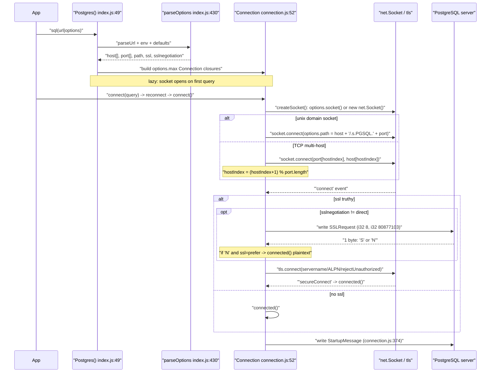

### node-postgres

Entry is `new Client(config)` (`pg/lib/client.js:50`), which builds `new ConnectionParameters(config)` (`client.js:54`). Parsing lives in two layers:
- `pg-connection-string` `parse()` (`pg-connection-string/index.js:8`): a leading `/` means a unix socket string (`{host, database}`, line 10-13); otherwise it parses via the `URL` constructor (with a `postgres://base` fallback base and a `___DUMMY___` host trick for `@/` empty-host strings, lines 27-36). It reads cert files synchronously from disk into `config.ssl.{cert,key,ca}` when `sslcert`/`sslkey`/`sslrootcert` are present (lines 88-100), and maps `sslmode` to ssl behavior — note the security-relevant default where `prefer`/`require`/`verify-ca` are currently treated as `verify-full` unless `uselibpqcompat` is set (lines 138-158, with a `deprecatedSslModeWarning`).
- `ConnectionParameters` (`connection-parameters.js:52`): applies `val()` precedence config -> `PG*` env -> `defaults` (line 9-23), `parseInt` on port (line 70), computes `isDomainSocket = !(this.host||'').indexOf('/')` (line 117), reads `PGSSLMODE` env if `ssl` is undefined (`readSSLConfigFromEnvironment`, line 25-38), and validates `sslnegotiation` ∈ {`postgres`,`direct`} throwing if `direct` without ssl (lines 104-112).

`Client` constructs a `Connection` (`client.js:89`) passing `stream: c.stream`, `ssl`, `sslNegotiation`, keepAlive. The socket factory is runtime-pluggable via `stream.js`: `getStream()` returns `new net.Socket()` on Node or a `CloudflareSocket` on Workers (`stream.js:20-53`). `Connection` (`pg/lib/connection.js:14`) takes `this.stream = config.stream || getStream(config.ssl)` in its constructor (line 19).

`Client._connect()` (`client.js:148`) sets an optional `connectionTimeoutMillis` timer that destroys the stream (lines 162-171), then dispatches on unix vs TCP: `con.connect(host + '/.s.PGSQL.' + port)` if host starts with `/`, else `con.connect(port, host)` (client.js:173-177). `Connection.connect()` (`connection.js:39`) does `stream.setNoDelay(true)` + `stream.connect(port, host)` and wires events. The SSL decision tree:
- no ssl -> `attachListeners(stream)` immediately (connection.js:66-68); on `connect`, Client sends `startup` (client.js:187-189).
- `sslNegotiation === 'direct'` -> on `connect`, call `upgradeToSSL` straight away with ALPN, no SSLRequest (connection.js:72-76); startup is sent on the `sslconnect` event (client.js:192-194).
- default `postgres` negotiation -> on `connect`, Client calls `con.requestSsl()` which writes `serialize.requestSsl()` (client.js:188, connection.js:140-142); `Connection` waits for one `data` byte and switches on `S` (proceed), `N` (end + error "does not support SSL"), or anything else (end + error) (connection.js:78-92), then `upgradeToSSL`.

`upgradeToSSL()` (connection.js:95) builds `{socket: stream}`, spreads a non-`true` ssl object, adds ALPN for direct mode, sets `servername` when host is not an IP (`net.isIP(host) === 0`, line 116), then `stream.getSecureStream(options)` (which is `tls.connect` on Node, `socket.startTls` on Cloudflare, stream.js:26-48), re-attaches the protocol parser, and emits `sslconnect`. The startup message follows.

```mermaid
sequenceDiagram
    participant App
    participant Client as "Client client.js:50"
    participant CP as "ConnectionParameters + pg-connection-string"
    participant Conn as "Connection connection.js:14"
    participant SF as "stream.js getStream/getSecureStream"
    participant PG as "PostgreSQL server"

    App->>Client: "new Client(config|url)"
    Client->>CP: "parse url, env, defaults; read cert files; sslmode"
    CP-->>Client: "host, port, ssl, sslnegotiation, isDomainSocket"
    Client->>Conn: "new Connection({stream, ssl, sslNegotiation})"
    Conn->>SF: "getStream(ssl): net.Socket or CloudflareSocket"
    App->>Client: "connect(cb)"
    Client->>Client: "optional connectionTimeout timer (destroy stream)"
    alt unix domain socket (host starts with '/')
        Client->>Conn: "con.connect(host + '/.s.PGSQL.' + port)"
    else TCP
        Client->>Conn: "con.connect(port, host)"
    end
    Conn->>SF: "stream.setNoDelay(true); stream.connect()"
    SF-->>Conn: "'connect' event"
    alt no ssl
        Conn->>Conn: "attachListeners(stream)"
        Conn->>PG: "startup (on connect)"
    else sslNegotiation == direct
        Conn->>SF: "upgradeToSSL: getSecureStream (ALPN postgresql)"
        SF-->>Conn: "'sslconnect' -> startup"
    else postgres negotiation
        Conn->>PG: "requestSsl(): SSLRequest packet"
        PG-->>Conn: "1 byte 'S' / 'N' / other"
        Note over Conn: "'N' or other -> stream.end() + emit error"
        Conn->>SF: "upgradeToSSL: getSecureStream (servername if not IP)"
        SF-->>Conn: "'sslconnect' -> startup"
    end
```

### Comparison & design takeaways for a new driver

- Parsing ownership: node-postgres isolates URL/env/file parsing in `pg-connection-string` + `ConnectionParameters` (testable, reusable, exported as `parse`/`toClientConfig`). postgres.js inlines everything into `parseOptions`/`parseUrl` (`index.js:430-559`) with hand-rolled string slicing to defeat `URL`'s inability to parse multi-host. Takeaway: keep a standalone, side-effect-free parser, but design it to natively understand multi-host instead of pre-mangling the string.
- Multi-host failover: postgres.js is the clear winner — it normalizes host/port to parallel arrays and round-robins via `hostIndex` (`connection.js:354-358`) with backoff retry baked into `closed()`/`error()`. node-postgres has no built-in multi-host or `target_session_attrs`; it relies on the caller/pool. A new driver should adopt array-based multi-host + `target_session_attrs` probing (postgres.js does this via `fetchState`/`tryNext`, `connection.js:790-810`).
- SSL negotiation is nearly identical in both (SSLRequest `80877103`, single-byte `S`/`N` check, `tls.connect` with `servername` skipped for IPs, ALPN for direct). Both relax `rejectUnauthorized` for weaker sslmodes — a footgun. node-postgres at least emits a `deprecatedSslModeWarning` because `prefer`/`require`/`verify-ca` silently meant `verify-full`; postgres.js's `ssl: 'prefer'` falls back to *plaintext* on `N` (`connection.js:271`), which is an MITM-downgrade risk worth flagging loudly. A new driver should make sslmode semantics explicit and libpq-compatible, and never silently downgrade to plaintext without an opt-in.
- Runtime abstraction: node-postgres's `stream.js` factory (`getStream`/`getSecureStream`) cleanly isolates Node vs Cloudflare socket creation — a good seam. postgres.js instead exposes a single `options.socket(options)` hook (`connection.js:132`) plus separate transpiled variants (cf/deno/cjs). The factory-function seam is cleaner for supporting multiple runtimes from one source.
- Cert file I/O: pg-connection-string does **synchronous** `fs.readFileSync` inside parsing (`index.js:90-100`), blocking the event loop and coupling parse to a filesystem. A new driver should read cert files lazily/async and allow passing buffers directly.
- Connection eagerness: postgres.js allocates all `max` connection closures up front (`index.js:65`) but only opens sockets lazily on first query; node-postgres's `Client` is a single connection opened explicitly via `connect()` with pooling layered on top in `pg-pool`. The new driver should keep socket creation lazy and decouple the pool from the wire connection (node-postgres's layering) while retaining postgres.js's per-connection backoff/lifetime timers (`connection.js:75-77`).
- Footgun in postgres.js: the SSL `prefer` path reads exactly one `data` chunk to detect `S` (`connection.js:269`); both drivers assume the server's reply arrives as a lone byte. Robust framing here matters — a new driver should treat the post-SSLRequest reply as a 1-byte read regardless of chunk boundaries.

### Verification notes
Verified against real source. Both Mermaid sequence diagrams are faithful to the actual control/message flow (SSLRequest 80877103, single-byte S/N check, direct-vs-postgres negotiation order, unix/TCP dispatch, startup-after-secure ordering) with correct message names and ordering. Valid Mermaid; no syntax errors found, nothing edited.

Citation/accuracy spot-checks (all confirmed unless noted):
- postgres.js: parseOptions index.js:430, parseUrl 537-559, host/port arrays 466-467, ssl aliasing 443/445/451/475, eager Connection alloc index.js:65, createSocket 129, secure() 266-294, connected() 365 + StartupMessage 374, closed()/reconnect()/error() 436/361/381, SSLRequest const 20, tryNext/fetchState 790-810 — all correct.
- node-postgres: Client client.js:50, ConnectionParameters 52 (val 9-23, port parseInt 70, isDomainSocket 117, readSSLConfigFromEnvironment 25-38, sslnegotiation validation 104-112), Connection connection.js:14/19, connect() 39 (setNoDelay/connect 43-44), no-ssl attachListeners 66-68, direct path 72-76, postgres S/N/other switch 78-92, upgradeToSSL 95 (servername isIP 116, getSecureStream 120), stream.js getStream/getSecureStream 20-53, pg-connection-string parse 8 (unix 10-13, URL/dummy 27-36, cert readFileSync 88-100, sslmode map 138-158) — all correct.

Minor discrepancies (non-blocking, not fixed):
1. Section line 69 cites "client.js:188" for the con.requestSsl() call; the actual call is at client.js:185 (line 188 is con.startup() in the no-ssl else branch). The connection.js:140-142 citation for requestSsl()'s body is correct.
2. Section line 9 simplifies the host array to "host.split(',')" but the real code is host.split(',').map(x => x.split(':')[0]) (strips :port). The parallel port-array citation (467) is quoted accurately.
3. Section line 13 says connect() runs "after a backoff delay" — true on reconnect, but the initial connect has closedTime=0 so reconnect() fires connect immediately (delay 0). Minor.
None of these change the described behavior or diagram correctness.


## Startup & Authentication Handshake

Both drivers open a TCP (or TLS) socket, optionally negotiate SSL, then send the PostgreSQL `StartupMessage` (protocol 3.0) carrying `user`/`database`/encoding pairs. The backend replies with an `AuthenticationRequest` (`R` message) whose sub-code selects the method: `0`=Ok, `3`=cleartext, `5`=MD5, `10`=SASL (SCRAM), `11`=SASLContinue, `12`=SASLFinal. The client answers each challenge with a `PasswordMessage`/SASL message (`p`), and the server then streams `ParameterStatus` (`S`), `BackendKeyData` (`K`) and finally `ReadyForQuery` (`Z`) to signal the connection is usable. The key divergence is structural: postgres.js inlines the entire handshake (including all SCRAM crypto) inside one `connection.js` closure, while node-postgres splits it across `Client` (orchestration via events), `Connection` (socket/serialize), a dedicated `crypto/sasl.js` SCRAM state machine, and `pg-protocol` for message framing — and only node-postgres implements channel binding (`SCRAM-SHA-256-PLUS`).

### postgres.js

Everything lives in the `Connection` factory closure in `src/connection.js`. After the socket connects, `connected()` (`connection.js:365-379`) writes `StartupMessage()` (`connection.js:996-1006`), which builds `int32 len, int16 3, int16 0` + null-delimited `user`/`database`/`client_encoding=UTF8` (+ `options.connection`) pairs. SSL is handled first in `secure()` (`connection.js:266-294`): unless `sslnegotiation==='direct'` it writes the 8-byte `SSLRequest` (`connection.js:20`) and peeks the single reply byte (`83`=`'S'`) before calling `tls.connect`; `direct` mode skips the probe and uses ALPN `['postgresql']`.

Inbound `R` messages are dispatched by `Authentication(x)` reading the sub-code at byte offset 5 (`connection.js:673-683`):
- **Cleartext** `AuthenticationCleartextPassword` (`connection.js:686-691`): awaits `Pass()` (password may be a function, `connection.js:749-754`) and writes a `p` message with the raw password.
- **MD5** `AuthenticationMD5Password` (`connection.js:693-705`): `'md5' + md5( md5(pass+user) ++ salt )` where `salt = x.subarray(9)` (4 bytes). `md5()` = `crypto.createHash('md5').digest('hex')` (`connection.js:1022-1024`).
- **SASL** `SASL()` (`connection.js:707-712`): generates `nonce = crypto.randomBytes(18).toString('base64')`, advertises only `SCRAM-SHA-256`, and sends a SASLInitialResponse with gs2 header `n,,` → client-first-bare `n,,n=*,r=<nonce>`. **No channel binding is ever offered.**
- **SASLContinue** `SASLContinue()` (`connection.js:714-739`): parses server-first into `{r,s,i}`; `saltedPassword = pbkdf2Sync(pass, base64(s), i, 32, 'sha256')` (`connection.js:717-722`); `clientKey = hmac(saltedPassword,'Client Key')`; builds `authMessage` manually; `serverSignature = hmac(hmac(saltedPassword,'Server Key'), auth)`; proof `p = clientKey XOR hmac(sha256(clientKey), auth)`; sends client-final with fixed `c=biws` (base64 of `n,,`). Helpers `hmac`/`sha256`/`xor` at `connection.js:1026-1040`.
- **SASLFinal** `SASLFinal()` (`connection.js:741-747`): string-compares the server `v=` signature against the saved `serverSignature`; on mismatch it errors and destroys the socket.

`BackendKeyData` stores `{pid,secret}` (`connection.js:763-766`). `ReadyForQuery` (`connection.js:535-588`) ends the handshake: if `needsTypes` it runs `fetchArrayTypes()`, optionally checks `target_session_attrs`, then executes the initial query or marks the connection open. Note crypto is `await`-ed even though `createHash`/`pbkdf2Sync` are synchronous (e.g. `await md5(...)`, `await crypto.pbkdf2Sync(...)`).

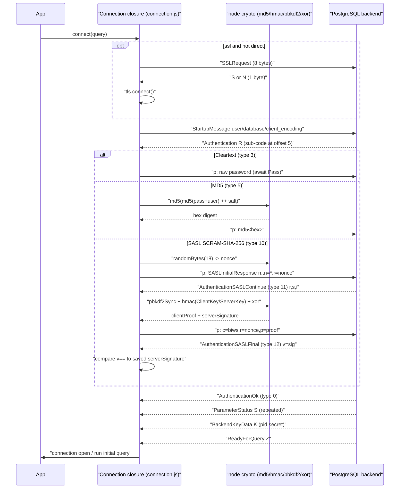

### node-postgres

The handshake is event-driven and layered. `Client._connect` (`pg/lib/client.js:148-225`) calls `con.connect(port,host)`; on the `'connect'` event it either calls `con.requestSsl()` or `con.startup(self.getStartupConf())` (`client.js:180-190`), and after a TLS upgrade the `'sslconnect'` event triggers `startup` (`client.js:192-194`). `getStartupConf` (`client.js:534-563`) assembles `user`/`database` (+ optional `application_name`, `replication`, timeouts, `options`); `serialize.startup` (`pg-protocol/src/serializer.ts:21-36`) appends `client_encoding=UTF8` and frames it. SSL probe lives in `Connection.connect` (`pg/lib/connection.js:39-93`): writes `requestSsl()`, reads one byte and branches on `'S'`/`'N'`/other, then `upgradeToSSL` (`connection.js:95-128`) wraps the socket via `tls`, adding ALPN `['postgresql']` for `direct` negotiation.

`pg-protocol`'s `parseAuthenticationResponse` (`parser.ts:331-379`) decodes the `R` sub-code into named messages (`authenticationCleartextPassword`, `authenticationMD5Password` with 4-byte `salt`, `authenticationSASL` with a `mechanisms[]` list, `...SASLContinue`/`...SASLFinal` with `data`). `Client._attachListeners` (`client.js:244-267`) binds each to a handler:
- **Cleartext** `_handleAuthCleartextPassword` (`client.js:308-312`): resolves the password (function/string/pgpass via `_getPassword`, `client.js:269-306`) then `connection.password(pass)`.
- **MD5** `_handleAuthMD5Password` (`client.js:314-323`): `crypto.postgresMd5PasswordHash(user,pass,salt)` (`crypto/utils.js:51-55`, two `md5` rounds) → `connection.password(hash)`.
- **SASL** `_handleAuthSASL` (`client.js:325-338`): `sasl.startSession(msg.mechanisms, enableChannelBinding && stream, scramMaxIterations)` (`crypto/sasl.js:35-60`). It prefers `SCRAM-SHA-256-PLUS` when channel binding is enabled and the TLS stream exposes `getPeerCertificate`; gs2 header is `p=tls-server-end-point` (bind), `y` (cb-capable but unused), or `n`. Sends SASLInitialResponse via `serialize.sendSASLInitialResponseMessage` (`serializer.ts:49-54`).
- **SASLContinue** `_handleAuthSASLContinue` (`client.js:340-352`): `sasl.continueSession` (`crypto/sasl.js:62-127`) validates the server nonce starts with the client nonce, enforces `scramMaxIterations`, **SASLprep-normalizes the password** (`sasl.js:21-31`), then via WebCrypto `crypto/utils.js`: `deriveKey` = PBKDF2-SHA256 (`utils.js:85-89`), `hmacSha256`/`sha256` (`utils.js:61-77`). For `-PLUS` it hashes the peer cert (`signatureAlgorithmHashFromCertificate`, MD5/SHA-1 upgraded to SHA-256) and sets `c=` to base64 of `p=tls-server-end-point,,<certHash>`. Sends client-final via `serialize.sendSCRAMClientFinalMessage` (`serializer.ts:56-58`).
- **SASLFinal** `_handleAuthSASLFinal` (`client.js:354-361`): `sasl.finalizeSession` (`crypto/sasl.js:129-142`) compares the server `v=` signature; mismatch throws.

`_handleBackendKeyData` (`client.js:363-366`) saves `processID`/`secretKey`. `_handleReadyForQuery` (`client.js:368-391`) flips `_connecting→_connected`, fires the connect callback and `'connect'` event, then drains the query queue. Errors during connect route through `_handleErrorWhileConnecting` (`client.js:395-406`).

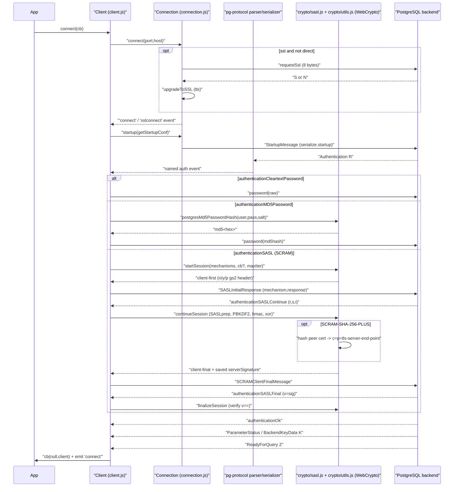

### Comparison & design takeaways for a new driver

- **Channel binding / SCRAM-SHA-256-PLUS**: node-postgres implements it (`crypto/sasl.js:45-110`, opt-in via `enableChannelBinding`, cert hashing with MD5/SHA-1→SHA-256 upgrade) and prioritizes `-PLUS` when on TLS. postgres.js hard-codes the `n,,`/`c=biws` non-binding path (`connection.js:711,732`) and never advertises `-PLUS`. A new driver targeting modern security should adopt node-postgres' channel-binding support (it defends against MITM on TLS), but make it default-on when on TLS rather than opt-in.
- **SASLprep**: node-postgres normalizes the password (NFKC + space/zero-width handling, `sasl.js:21-31`) so non-ASCII passwords match libpq/psql. postgres.js skips SASLprep entirely, a real footgun for Unicode passwords (silent `28P01`). A new driver MUST do SASLprep before PBKDF2.
- **Crypto API**: node-postgres uses WebCrypto/`subtle` (async, runtime-portable to Workers/Deno) but pays for `importKey` on every HMAC (`utils.js:74-77`). postgres.js uses synchronous Node `crypto` yet pointlessly `await`s it. A new driver should pick one async-capable abstraction, cache imported HMAC keys, and avoid fake awaits.
- **Server-signature verification**: both verify `SASLFinal`'s `v=`. postgres.js does a raw string compare (`connection.js:742`); node-postgres also compares strings but with full attribute parsing/validation (`sasl.js:129-142`). Neither uses constant-time comparison — a minor hardening opportunity.
- **Iteration-count DoS guard**: only node-postgres bounds PBKDF2 iterations (`scramMaxIterations`, `sasl.js:84-94`). postgres.js trusts the server's `i` unconditionally — adopt the cap.
- **Architecture**: postgres.js' single-closure handler dispatch (`connection.js:673-683`) is compact and allocation-light but mixes protocol, crypto, and socket concerns, making it hard to unit-test SCRAM in isolation. node-postgres' separation (`pg-protocol` framing / `crypto/sasl.js` pure state machine / `Connection` I/O / `Client` orchestration via EventEmitter) is cleaner and testable, at the cost of more indirection and per-message event emission. A new driver should keep node-postgres' layering (a pure, side-effect-free SCRAM module) but use direct callbacks/state instead of EventEmitter fan-out to cut overhead.
- **Password sourcing**: both support a password-returning function; node-postgres adds (deprecated) pgpass and hides the password as a non-enumerable property (`client.js:62-67`). A new driver should keep async password resolution and non-enumerable storage, drop pgpass from core.
- **SSL negotiation**: both support classic `SSLRequest` probe and `direct` ALPN negotiation; postgres.js additionally supports `ssl: 'prefer'` falling back to cleartext (`connection.js:271-272`). Replicate `direct` (avoids a round-trip) and be explicit about prefer/require/verify modes.

### Verification notes
Verified: diagrams faithful to source, valid Mermaid. Spot-checked every file:line citation against the real source — all accurate (postgres.js connection.js: secure 266-294, connected 365-379, Authentication dispatch 673-683, Cleartext 686-691, MD5 693-705, SASL 707-712, SASLContinue 714-739, SASLFinal 741-747, BackendKeyData 763-766, ReadyForQuery 535-588, StartupMessage 996-1006, SSLRequest l.20, crypto helpers 1022-1040; node-postgres client.js _connect 148-225, _attachListeners 244-267, _getPassword 269-306, auth handlers 308-361, _handleBackendKeyData 363-366, _handleReadyForQuery 368-391, getStartupConf 534-563, password defineProperty 62-67; sasl.js startSession 35-60, continueSession 62-127, finalizeSession 129-142, saslprep 21-31; utils.js postgresMd5PasswordHash 51-55, hmacSha256/sha256 61-77, deriveKey 85-89; serializer.ts startup 21-36, SASLInitial 49-54, SCRAMFinal 56-58; parser.ts parseAuthenticationResponse 331-379; connection.js connect 39-93, upgradeToSSL 95-128). Crypto formulas (MD5 double-hash, SCRAM clientProof = clientKey XOR HMAC(SHA256(clientKey), authMessage), serverSignature, c=biws/eSws, gs2 n/y/p) all match code. SASLprep, scramMaxIterations cap, channel-binding cert hashing, and the "postgres.js never offers -PLUS / no SASLprep / fake-awaits sync crypto" claims are all confirmed.

Two minor (non-material) imprecisions, not corrected:
1. postgres.js ReadyForQuery (l.535-588): code checks `target_session_attrs` BEFORE `needsTypes`/`fetchArrayTypes`; the prose lists them in the reverse order ("if needsTypes ... fetchArrayTypes(), optionally checks target_session_attrs"). The set of steps is right; only the listing order is flipped.
2. node-postgres prose says "SSL probe lives in Connection.connect ... writes requestSsl()". The actual `con.requestSsl()` write is issued from client.js (l.185) on the 'connect' event; Connection.connect (l.39-93) only installs the data listener that reads the 'S'/'N' byte and branches. Citation range is correct; attribution of the write is slightly loose.


## Extended Query Protocol (Parse/Bind/Describe/Execute/Sync)

Both drivers implement the PostgreSQL extended-query flow by serializing `Parse`, `Bind`, `Describe`, `Execute`, and `Sync` messages and demultiplexing the inbound `ParseComplete`/`BindComplete`/`RowDescription`/`DataRow`/`CommandComplete`/`ReadyForQuery` stream against a single in-flight query object. They differ sharply in three places: **what gets Described** (postgres.js describes the *statement* `S`, node-postgres describes the *portal* `P`), **how parameters are encoded** (postgres.js always text, node-postgres per-parameter text-or-binary), and **how much they pipeline** (postgres.js pipelines many queries and even does a two-round-trip "describe-first" to learn parameter OIDs; node-postgres runs exactly one active query at a time gated on `ReadyForQuery`). In both, results come back as **text** by default and are decoded by per-column parsers keyed on the type OID learned from `RowDescription`.

### postgres.js

A `Query` is a lazy `Promise` subclass; nothing is sent until `.handle()` runs the handler on a microtask (`query.js:139-146`, `then` at `query.js:148`). The handler is `Connection.execute` (`connection.js:156`), which calls `build(q)` then `write(toBuffer(q))`.

- `build(q)` (`connection.js:224`) runs `stringify` to turn the tagged template into SQL plus a `parameters[]`/`types[]` pair (`types.js:98`, `handleValue` at `types.js:75`, OID inference in `inferType` at `types.js:220`). It computes `q.signature = types + string` (`connection.js:234`), looks up `statements[signature]` for a cached prepared statement (`connection.js:237`), and sets `q.describeFirst = onlyDescribe || (parameters.length && !prepared)` (`connection.js:238`).
- `toBuffer(q)` (`connection.js:185`) selects the message bundle:
  - First execution of a parameterized prepared statement → `describeFirst`: send `Parse` + `Describe('S', name)` + `Flush` (`connection.js:191-192`, `describe()` at `200`). It deliberately stops before Bind to learn parameter types from the server.
  - Already-prepared → `prepared(q)`: `Bind` + `ExecuteUnnamed` (`connection.js:207`). `ExecuteUnnamed` is `Execute('') + Sync` prebuilt at `connection.js:21`.
  - Non-prepared/unnamed → `unnamed(q)`: `Parse` + `DescribeUnnamed` (`'S'` empty name) + `Bind` + `ExecuteUnnamed` (`connection.js:216`).
- Wire encoders: `Parse` (`connection.js:972`) writes name, SQL, and `types[i] || 0` per param OID. `Bind` (`connection.js:948`) writes portal, statement, `i16(0)` parameter-format-code count (**zero ⇒ all text**), then for each value `type in options.serializers ? serializers[type](x) : '' + x` (`connection.js:959`) — every value is stringified — and a trailing `i16(0)` result-format count (**all results text**).
- Inbound handlers dispatched by `handle()` (`connection.js:461`): `ParseComplete` clears `parsing` (`617`); `ParameterDescription` (`626`) fills missing `statement.types[i]` from server OIDs, caches the statement in `statements[signature]` (`632`), and — crucially for `describeFirst` — writes the deferred `prepared(q)` (Bind+Execute+Sync) on the *second* round trip (`633`); `RowDescription` (`636`) builds `statement.columns[]` with `parser: parsers[type]` per OID (`661`); `BindComplete` (`621`) attaches columns to the result; `DataRow` (`492`) decodes each field as UTF-8 text through `column.parser` (array-aware) into a plain object or raw array; `CommandComplete` (`590`) sets `result.count`/`command`; `ReadyForQuery` (`535`) resolves the query and pulls the next from the `sent` pipeline queue.

```mermaid
sequenceDiagram
    participant App
    participant Q as "Query (query.js)"
    participant C as "Connection.execute (connection.js)"
    participant S as Socket
    participant PG as PostgreSQL

    App->>Q: sql`select ... where id=${id}`
    Q->>Q: "then/handle -> microtask (query.js:139)"
    Q->>C: handler(q) -> execute(q)
    C->>C: "build(q): stringify, signature, describeFirst (connection.js:224)"

    alt "first time, params present (describeFirst)"
        C->>S: "Parse + Describe S + Flush (connection.js:191)"
        S->>PG: bytes
        PG-->>S: ParseComplete
        PG-->>S: "ParameterDescription (param OIDs)"
        PG-->>S: "RowDescription (columns) or NoData"
        S-->>C: handlers fill types and columns
        C->>C: "cache statements[signature] (connection.js:632)"
        C->>S: "Bind + Execute + Sync (prepared, connection.js:633)"
        S->>PG: bytes
    else "cached prepared statement"
        C->>S: "Bind + Execute + Sync (connection.js:207)"
        S->>PG: bytes
    else "unnamed (no prepare)"
        C->>S: "Parse + Describe S + Bind + Execute + Sync (connection.js:216)"
        S->>PG: bytes
    end

    PG-->>S: BindComplete
    S-->>C: "BindComplete -> result.columns (connection.js:621)"
    loop each row
        PG-->>S: DataRow
        S-->>C: "decode text via column.parser (connection.js:492)"
    end
    PG-->>S: CommandComplete
    S-->>C: "result.count / command (connection.js:590)"
    PG-->>S: ReadyForQuery
    S-->>C: "resolve(query); shift next from sent queue (connection.js:535)"
    C-->>App: rows
```

### node-postgres

`Client.query` enqueues a `Query` (EventEmitter); `_pulseQueryQueue` (`client.js:603`) makes it the single `_activeQuery`, gated on `readyForQuery`, then calls `query.submit(connection)` (`query.js:152`).

- `submit` → `requiresPreparation()` (`query.js:35`): extended protocol is used when `queryMode==='extended'`, or a `name` is set, or `rows` is set, or there are values; otherwise a plain simple `Query('Q')` is sent (`query.js:179-180`).
- `prepare(connection)` (`query.js:209`) issues, around a `stream.cork()/uncork()` (`query.js:171-178`): `Parse` only if `!hasBeenParsed` (named statements parsed once — `query.js:185`, `211`), then `Bind`, then `Describe({type:'P', portal})` — **it describes the portal, not the statement** (`query.js:239`), then `Execute` + `Sync` via `_getRows` (`query.js:193-206`). With a `rows` page size it sends `Execute` + `Flush` instead and syncs later (`query.js:200-205`).
- The connection layer is a thin wrapper: `parse`/`bind`/`execute`/`describe`/`sync`/`flush` each call `serialize.*` and `stream.write` (`connection.js:176-227`).
- Wire encoders in `serializer.ts`: `parse` (`72`) writes name, text, and `types[i]` OIDs. `bind` (`144`) is the key contrast — `writeValues` (`121`) maps each value via `prepareValue` (`utils.js:44`) and emits a **per-parameter format code**: `Buffer` ⇒ binary `1` with raw bytes, otherwise string `0` with UTF-8 (`serializer.ts:129-140`). Result formats use a single `addInt16(1)` count + one format code (`binary?1:0`, default text) applied to all columns (`serializer.ts:166-169`). `execute` has a fast-path constant `emptyExecute` buffer for the no-portal/no-rows case (`serializer.ts:178`).
- Inbound: `pg-protocol`'s singleton `Parser` (`parser.ts:80`) frames messages and emits constant singletons for `bindComplete`/`parseComplete`/`noData` (no per-message allocation, `parser.ts:166-189`). `Connection.attachListeners` re-emits each by name (`connection.js:130`); `Client` handlers delegate to the active `Query`: `_handleParseComplete` records `parsedStatements[name]` (`client.js:501`); `handleRowDescription` (`query.js:76`) calls `result.addFields` which precomputes a parser per column from `pg-types.getTypeParser(dataTypeID, format)` and a prebuilt empty row object (`result.js:82-106`); `handleDataRow` (`query.js:82`) calls `result.parseRow` (`result.js:63`), converting binary fields via `Buffer.from` then the parser; `handleCommandComplete` (`query.js:102`) sets `command`/`rowCount`; `handleReadyForQuery` (`query.js:136`) fires the callback/`end` event, then `_pulseQueryQueue` runs the next query (`client.js:383-390`).

```mermaid
sequenceDiagram
    participant App
    participant CL as "Client (_pulseQueryQueue)"
    participant Q as "Query.submit (query.js)"
    participant CN as "Connection (connection.js)"
    participant PG as PostgreSQL

    App->>CL: client.query(text, values)
    CL->>CL: "gate on readyForQuery; set _activeQuery (client.js:603)"
    CL->>Q: submit(connection)
    Q->>Q: "requiresPreparation? (query.js:35)"

    alt extended protocol
        Q->>CN: "stream.cork() (query.js:171)"
        opt "not yet parsed"
            Q->>CN: parse -> serialize.parse
            CN->>PG: Parse
        end
        Q->>CN: "bind (per-param text/binary format codes)"
        CN->>PG: Bind
        Q->>CN: "describe type P (portal!) (query.js:239)"
        CN->>PG: Describe P
        Q->>CN: "execute + sync (query.js:193)"
        CN->>PG: Execute + Sync
        Q->>CN: "stream.uncork()"
    else simple
        Q->>CN: connection.query(text)
        CN->>PG: "Query (simple)"
    end

    PG-->>CL: ParseComplete
    CL->>CL: "record parsedStatements[name] (client.js:501)"
    PG-->>CL: BindComplete
    PG-->>CL: "RowDescription (from portal)"
    CL->>Q: "handleRowDescription -> addFields, precompute parsers (query.js:76)"
    loop each row
        PG-->>CL: DataRow
        CL->>Q: "handleDataRow -> parseRow (query.js:82)"
    end
    PG-->>CL: CommandComplete
    CL->>Q: "handleCommandComplete -> rowCount (query.js:102)"
    PG-->>CL: ReadyForQuery
    CL->>Q: "handleReadyForQuery -> callback/end (query.js:136)"
    CL->>CL: "_pulseQueryQueue() next (client.js:390)"
    CL-->>App: result
```

### Comparison & design takeaways for a new driver

- **Describe target differs (semantic, not cosmetic).** postgres.js describes the *statement* (`Describe 'S'`), so it receives `ParameterDescription` + `RowDescription` and learns authoritative *parameter* OIDs before Bind. node-postgres describes the *portal* (`Describe 'P'`, `query.js:239`), so it never gets `ParameterDescription` and relies entirely on client-side `prepareValue` text coercion for params. The statement-describe approach is more correct for parameter typing but costs a round trip the first time.
- **Parameter encoding.** node-postgres supports mixed text/binary per parameter (`Buffer` ⇒ binary, else text — `serializer.ts:129`), which is efficient for `bytea`. postgres.js always sends `i16(0)` format codes ⇒ **everything is text** (`connection.js:952`, `959`), even `bytea` (hex-encoded via the serializer, `types.js:37`). A new driver should adopt per-parameter binary at least for `bytea`/`bool`/ints to cut serialization cost, while keeping a text fallback.
- **Result encoding.** Both request all results as **text** (`Bind` result-format `0`). Neither decodes binary row data by default (node-postgres parser literally throws on `mode:'binary'`, `parser.ts:88`). Binary result decoding is the single biggest untapped perf win — a new driver should negotiate binary result formats for known OIDs.
- **Pipelining vs serialization.** postgres.js maintains a `sent` queue and pipelines up to `max_pipeline` queries without waiting for `ReadyForQuery`, and even defers Bind across a round trip in describe-first mode (`connection.js:173-177`, `633`). node-postgres is strictly one-active-query-at-a-time, gated on `ReadyForQuery` in `_pulseQueryQueue` (`client.js:604`). The pipelined design is dramatically faster under concurrency; a new driver should pipeline by default but must carefully bind error/`Sync` recovery to the right query (postgres.js's error path manually writes `Sync` for `cursorFn`/`describeFirst` at `connection.js:326`, `814` — a visible footgun).
- **Statement caching.** postgres.js auto-prepares and caches by `types + string` signature (`connection.js:234-241`), silently reusing prepared statements; it also has retry-on-`RevalidateCachedQuery` logic (`connection.js:25-29`, `538-541`) — a real footgun where a stale cached plan triggers a transparent re-parse. node-postgres only prepares when you pass an explicit `name` and tracks `parsedStatements[name]` (`client.js:501`). A new driver should cache prepared statements but must invalidate on schema-change errors and bound the cache size.
- **Allocation discipline.** node-postgres's parser reuses singleton message objects and a shared `BufferReader`, and precomputes the per-column parser array + an empty-row template once per `RowDescription` (`result.js:89-106`); decoding then clones the template. postgres.js avoids intermediate message objects entirely, decoding `DataRow` inline straight off the socket buffer into the result (`connection.js:492-524`) — the leanest hot path of the two. A new driver should follow postgres.js: decode rows inline with no per-message object, but borrow node-postgres's precomputed-parser-array idea.
- **Lazy vs eager.** postgres.js overloads `Promise`/thenable semantics so a query only fires on `await`/`.then` (`query.js:139-161`) — elegant but surprising (calling `.then` twice or inspecting the promise has side effects). node-postgres uses an explicit queue + EventEmitter, which is more predictable. A new driver should keep execution explicit and avoid hiding I/O behind `then`.
- **Result shape.** postgres.js returns a `Result extends Array` (rows are the array, metadata as non-enumerable props — `result.js`), node-postgres returns `{ rows, rowCount, fields, command }`. The array-as-result is ergonomic but conflates collection and metadata; a new driver should prefer an explicit result object with a `rows` field.

### Verification notes
Verified against source: diagrams faithful, valid Mermaid, no syntax errors. Spot-checked every cited line.

postgres.js: `execute` connection.js:156, `toBuffer` 185, `describe` 200 (Parse+Describe 'S'), `prepared` 207 (Bind+ExecuteUnnamed where ExecuteUnnamed=Execute('')+Sync, prebuilt line 21), `unnamed` 216, `build` 224, signature 234, prepared lookup 237, describeFirst 238 — all correct. Bind 948 with i16(0) param-format count at 952 (all-text) and trailing i16(0) result-format at 967; per-value `'' + x` stringify at 959. Parse 972 (`types[i]||0`). Handlers: handle() 461, DataRow 492, ReadyForQuery 535 (resolve 544 / shift sent 573), CommandComplete 590, ParseComplete 617, BindComplete 621, ParameterDescription 626 (fill types 630, cache statements 632, deferred write(prepared) 633), RowDescription 636 — all correct. Error-path Sync writes at 326 and 814 confirmed. retryRoutines 25-29, retry 538-541 confirmed. types.js bytea hex 37, handleValue 75, stringify 98, inferType 220 confirmed.

node-postgres: requiresPreparation query.js:35, simple path 179-180, prepare 209, cork/uncork 171-178, parse-if-unparsed 211, describe portal 'P' 239, _getRows 193-206 (sync when no rows / flush when paging). serializer parse 72, bind 144, writeValues 121 (Buffer⇒binary 1 / else string 0, lines 124-140), result-format addInt16(1)+code 166-169, emptyExecute 178. parser.ts: Parser 80, binary-mode throw 88, singleton messages 166-189. connection.js wrapper parse/bind/execute/flush/sync/describe 176-227, attachListeners re-emit 130. client.js _pulseQueryQueue 603 (gate 604, shift 605, submit 611), parsedStatements record 501-502, next-pulse path 383-390. result.js parseRow 63 (Buffer.from for binary 69), addFields 82-106 (precompute parsers 99/101, prebuilt empty row 105). utils prepareValue 44 (wrapper 199). All correct.

Both inbound/outbound message orderings in the sequence diagrams match the code (Parse/Bind/Describe/Execute/Sync out; ParseComplete/[ParameterDescription]/RowDescription/DataRow*/CommandComplete/ReadyForQuery in). The describe-first two-round-trip and the portal-vs-statement Describe distinction are accurately depicted.

Trivial nit (not corrected, not material): the postgres.js bullet cites RowDescription's `parser: parsers[type]` at connection.js:661; the exact line is 660 (the object-literal field). Off-by-one within the same statement. No other discrepancies found.


## Simple Query Protocol & Multi-statement

The PostgreSQL simple Query message ('Q', byte `0x51`) carries one SQL string that may contain several `;`-separated statements; the backend replies with an independent `RowDescription`/`DataRow*`/`CommandComplete` cycle per statement and a single trailing `ReadyForQuery`. Both drivers detect "a second statement started" the same structural way — a fresh `RowDescription` (or `CommandComplete`) arriving when the current result already has a `command` set — and roll the accumulated results into an array. The crucial divergence is the *default*: postgres.js defaults tagged-template queries to the **extended/prepared** protocol and treats simple as opt-in (`.simple()`, `sql.unsafe(...)`, `sql.file(...)`), whereas node-postgres defaults to **simple** and only escalates to extended when the query actually requires it (`requiresPreparation()` in pg/lib/query.js:35-58). Simple protocol cannot carry bind parameters and always returns text-format values.

### postgres.js

- A tagged-template `sql\`...\`` builds a `Query` (src/index.js:110-117) that is extended/prepared by default. Simple mode is entered by `Query.simple()` (src/query.js:56-60), which sets `options.simple = true` and `options.prepare = false`; `sql.unsafe(string)` and `sql.file(path)` auto-set `simple: args.length === 0` (src/index.js:124, 141).
- `execute(q)` (src/connection.js:156-183) makes the query active and calls `build(q)` then `toBuffer(q)`. In `toBuffer` (src/connection.js:185-198) the simple branch emits a single message: `b().Q().str(q.statement.string + b.N).end()` — code `Q` plus the SQL string and a NUL terminator. No `Sync` is appended because simple protocol auto-syncs on the backend.
- `build` (src/connection.js:224-244) still runs `stringify`, so for `.simple()` there is no parameter binding wire-side; parameters cannot be transmitted in this path.
- Incoming messages are dispatched by the first byte in `handle` (src/connection.js:461-490). For a simple query: `RowDescription` (636-671) builds `query.statement.columns`; `DataRow` (492-524) parses each row into `result[rows++]`; `CommandComplete` (590-615) records `result.command`/`result.count`, and for simple queries explicitly calls `BindComplete()` (line 608-609) to attach columns to the result.
- Multi-statement accumulation: when a new `RowDescription` arrives and `result.command` is already set (src/connection.js:637-642), the prior `result` is pushed into a `results` array and a new `Result` is created. `ReadyForQuery` (535-588) finally does `query.resolve(results || result)` — an array of `Result`s for multi-statement, or a single `Result` otherwise.

```mermaid
sequenceDiagram
    participant App
    participant Q as "Query (query.js)"
    participant Conn as "Connection (connection.js)"
    participant PG as PostgreSQL
    App->>Q: "sql.unsafe('select 1; select 2')"
    Note over Q: "options.simple = true, prepare = false"
    Q->>Conn: "handler -> execute(q)"
    Conn->>Conn: "build(q): stringify, set q.statement.string"
    Conn->>Conn: "toBuffer: b().Q().str(sql + NUL).end()"
    Conn->>PG: "Query 'Q' (whole multi-statement string)"
    PG-->>Conn: "RowDescription (stmt 1)"
    Conn->>Conn: "build query.statement.columns"
    PG-->>Conn: "DataRow* (stmt 1)"
    PG-->>Conn: "CommandComplete (stmt 1) -> BindComplete()"
    PG-->>Conn: "RowDescription (stmt 2)"
    Note over Conn: "result.command set -> push result, new Result()"
    PG-->>Conn: "DataRow* (stmt 2)"
    PG-->>Conn: "CommandComplete (stmt 2)"
    PG-->>Conn: "ReadyForQuery"
    Conn->>Q: "query.resolve(results || result)"
    Q-->>App: "array of Results (or single Result)"
```

### node-postgres

- `client.query(...)` wraps the request in a `Query` (pg/lib/query.js) and pushes it onto `_queryQueue`; `_pulseQueryQueue` (pg/lib/client.js:603-624) shifts the next query when `readyForQuery`, sets `_activeQuery`, and calls `activeQuery.submit(this.connection)`.
- `Query.submit` (pg/lib/query.js:152-183) chooses the protocol: if `requiresPreparation()` (pg/lib/query.js:35-58) is true (`queryMode === 'extended'`, or a `name`, or `rows`, or non-empty `values`) it corks the stream and runs the extended `prepare`; otherwise it calls `connection.query(this.text)` — the simple path. So a plain `client.query('select 1; select 2')` with no values uses simple protocol.
- `connection.query(text)` (pg/lib/connection.js:171-173) → `serialize.query(text)` (pg-protocol/src/serializer.ts:60-62) writes `writer.addCString(text).flush(code.query)` — a single `Q` message.
- The parser raises events that `client._attachListeners` (pg/lib/client.js:244-267) routes to the active query's handlers. `handleRowDescription` (pg/lib/query.js:76-80) and `handleCommandComplete` (102-110) both call `_checkForMultirow` (60-71): if `_result.command` is already set, `_results` becomes an array and a fresh `Result` is pushed for the next statement.
- `handleReadyForQuery` (pg/lib/query.js:136-150) invokes `callback(null, this._results)` and emits `end` — `_results` is the single `Result` for one statement, or an array for a multi-statement string. Note simple-protocol `CommandComplete` does *not* trigger `connection.sync()` (that only happens in the `rows` extended-cursor case, query.js:107-109).

```mermaid
sequenceDiagram
    participant App
    participant Client as "Client (client.js)"
    participant Q as "Query (query.js)"
    participant Conn as "Connection + serializer"
    participant PG as PostgreSQL
    App->>Client: "client.query('select 1; select 2')"
    Client->>Client: "_queryQueue.push; _pulseQueryQueue()"
    Client->>Q: "submit(connection)"
    Q->>Q: "requiresPreparation()? no values/name/rows -> false"
    Q->>Conn: "connection.query(text)"
    Conn->>PG: "serialize.query -> 'Q' message"
    PG-->>Q: "RowDescription (stmt 1) -> _checkForMultirow"
    PG-->>Q: "DataRow* (stmt 1) -> parseRow/addRow"
    PG-->>Q: "CommandComplete (stmt 1) -> addCommandComplete"
    PG-->>Q: "RowDescription (stmt 2)"
    Note over Q: "_result.command set -> _results becomes array, new Result"
    PG-->>Q: "DataRow* + CommandComplete (stmt 2)"
    PG-->>Client: "ReadyForQuery -> handleReadyForQuery"
    Q-->>App: "callback(null, _results) / emit('end')"
    Client->>Client: "_pulseQueryQueue() next"
```

### Comparison & design takeaways for a new driver

- **Opposite defaults.** postgres.js defaults to extended/prepared and makes simple opt-in (`.simple()`, `unsafe`, `file`); node-postgres defaults to simple and escalates to extended only when `requiresPreparation()` says so. node-postgres's data-driven escalation (presence of `values`/`name`/`rows`) is harder to misuse; postgres.js's "prepared by default" gives plan caching for free but requires the user to remember `.simple()` for multi-statement strings.
- **Multi-statement requires simple.** In both libs, the extended `Parse` path accepts only a single command, so multi-statement strings *must* go through `Q`. node-postgres routes there automatically (no values); in postgres.js the user must call `.simple()`/`unsafe` or the multi-statement string is sent as one prepared `Parse` and the backend rejects it. A new driver should detect multi-statement input or document the constraint explicitly.
- **Parameter footgun in postgres.js.** `.simple()` forces `prepare = false` but `build()` still runs `stringify`; the simple `Q` branch (connection.js:189) ignores any collected parameters, so bound values silently do not reach the server. node-postgres is safer: `requiresPreparation()` returns true as soon as `values.length > 0`, auto-upgrading to extended. A new driver should *refuse* (throw) when parameters are supplied with an explicit simple request rather than silently dropping them.
- **Cleaner serialization boundary in node-postgres.** pg-protocol's `serialize.*` are pure `(args) -> Buffer` functions (serializer.ts) decoupled from connection state, with preallocated constant buffers (`emptyExecute`, `syncBuffer`). postgres.js inlines message building into the connection closure (`b().Q()...`, shared mutable `b` writer) — faster to write but harder to test/reuse and reliant on a single shared buffer cursor. Prefer node-postgres's separation, but keep postgres.js's preallocated constant messages and message coalescing (`write()` buffering at connection.js:246-259).
- **Result accumulation is identical in spirit.** Both detect a new statement by "RowDescription/CommandComplete while a command is already recorded" and lazily promote a single result to an array (connection.js:637-642 vs query.js:60-71). Adopt this; but standardize the return shape — postgres.js returns `results || result` (array *or* scalar) and node-postgres returns `_results` (array *or* scalar) too, which forces callers to type-check. A new driver should consistently return an array of result sets for the simple path.
- **Sync semantics.** Simple protocol self-syncs server-side, so neither lib appends `Sync` for `Q` (postgres.js toBuffer omits it; node-postgres only syncs in the extended `rows` cursor case). A new driver must not pipeline a manual `Sync` after a simple query or it will desynchronize the `ReadyForQuery` accounting.
- **Security angle.** node-postgres exposes `queryMode: 'extended'` to force the extended protocol even with zero params (avoiding simple-protocol injection surface). Worth adopting as an explicit per-query/connection knob.

### Verification notes
All file:line citations confirmed against source:
- postgres.js: `.simple()` query.js:56-60; `sql()` builds Query index.js:110-117; `unsafe` simple at index.js:124; `file` simple at index.js:141; `execute` connection.js:156-183; `toBuffer` 185-198 (simple branch line 189-190 = `b().Q().str(q.statement.string + b.N).end()`); `build` 224-244; `handle` dispatch 461-490; `DataRow` 492-524; `CommandComplete` 590-615 (simple -> `BindComplete()` at 608-609); `BindComplete` 621-624 sets `result.columns`; `ReadyForQuery` 535-588 (`query.resolve(results || result)` at 544); `RowDescription` 636-671 (multi-statement promotion 637-642); `write()` coalescing 246-259.
- node-postgres: `requiresPreparation` query.js:35-58; `submit` 152-183; `_checkForMultirow` 60-71; `handleRowDescription` 76-80; `handleCommandComplete` 102-110 (sync only when `this.rows`, 107-109); `handleReadyForQuery` 136-150 (`callback(null,this._results)` 142, `emit('end')` 149); `_pulseQueryQueue` client.js:603-624; `_attachListeners` 244-267; `connection.query` 171-173; `serialize.query` serializer.ts:60-62 (`writer.addCString(text).flush(code.query)`); preallocated `emptyExecute` (178) / `syncBuffer` (255) confirmed.

CORRECTION (one material imprecision):
- Lines 3 and 76 claim BOTH drivers detect a new statement via "a fresh RowDescription (or CommandComplete)". This is accurate ONLY for node-postgres, where `_checkForMultirow` (query.js:60-71) is invoked from BOTH `handleRowDescription` (76-80) AND `handleCommandComplete` (102-110). In postgres.js the promotion logic lives ONLY in `RowDescription` (connection.js:637-642); `CommandComplete` (590-615) performs NO multi-statement promotion. Consequence: a postgres.js simple multi-statement string of non-row-returning commands (e.g. `update x; update y` with no RowDescription between them) does not split into separate Result objects the way node-postgres would. The "(or CommandComplete)" parenthetical (line 3) and the "RowDescription/CommandComplete" phrasing for the postgres.js side (line 76, citing connection.js:637-642) overstate postgres.js's behavior. Both Mermaid diagrams are nonetheless FAITHFUL — each correctly shows the result-array promotion occurring on the stmt-2 RowDescription, not on CommandComplete.

Mermaid: both diagrams are valid and will render (quoted participant aliases/labels are cosmetic, not syntax errors; in-text `;`, parentheses, and the literal word `end` inside quoted message text do not terminate blocks). No syntax fixes required.


## Wire Protocol: Framing, Parsing & Serialization

The PostgreSQL frontend/backend protocol frames every backend message as `[1-byte type code][Int32 length-including-itself-but-not-the-code][body]`, and most frontend messages the same way (the startup/SSL/cancel packets are the exception — they carry only a length, no code). Both drivers must therefore (1) re-assemble messages that straddle TCP chunk boundaries, (2) dispatch on the type byte, and (3) decode bodies with a cursor-style reader; for the outbound direction both build bytes into a growable buffer and back-patch the Int32 length once the body size is known. node-postgres isolates all of this in a standalone `pg-protocol` package (a `Parser` class + `BufferReader`/`Writer` + a `serialize` table), whereas postgres.js inlines framing into `connection.js`'s `data()` handler and uses a single shared mutable byte builder `bytes.js` (`b`) plus direct `Buffer` reads inside per-message handlers.

### postgres.js

Inbound framing lives in `data(x)` at `connection.js:301`. It keeps a persistent `incoming` buffer plus an `incomings` array used as a fast-path accumulator for a single large message that spans chunks. On each socket `data` event:
- If a message is mid-assembly (`incomings` set, `connection.js:302`), the new chunk is pushed and `remaining` is decremented; it returns early until `remaining <= 0`, then `Buffer.concat`s exactly `length - remaining` bytes (`connection.js:309-310`).
- Otherwise it concatenates the leftover `incoming` with the new chunk (`connection.js:311-313`).
- The framing loop (`connection.js:315-332`) runs while `incoming.length > 4`: it reads the Int32 length at offset 1 (`readUInt32BE(1)`, `connection.js:316`) — note it reads length before validating the code byte. If `length >= incoming.length` the full message has not arrived, so it sets up `remaining`/`incomings` and breaks (`connection.js:317-321`). Otherwise it slices `incoming.subarray(0, length + 1)` (code byte + body) and calls `handle()` (`connection.js:324`), then advances `incoming = incoming.subarray(length + 1)` (`connection.js:329`).

Dispatch is a single nested-ternary lookup on the first byte `x = xs[0]` in `handle()` (`connection.js:461-490`) mapping char codes (68=`D` DataRow, 90=`Z` ReadyForQuery, 84=`T` RowDescription, 82=`R` Authentication, 69=`E` ErrorResponse, etc.) to handler functions. Each handler reads fields directly off the raw `Buffer` with hard-coded offsets — e.g. `DataRow` starts at index 7 and walks `readInt32BE` per column value (`connection.js:492-512`); `RowDescription` reads `readUInt16BE(5)` field count then per-field table/number/type via fixed offsets (`connection.js:644-660`). There is no intermediate reader object and no per-message allocation for the common path.

Outbound, the shared builder `b` in `bytes.js` is a singleton object over a module-level `buffer` (`bytes.js:1-63`). Calling `b.B()`, `b.P()`, etc. writes the type code at `buffer[0]` and sets the write cursor `b.i = 5`, reserving 4 bytes for the length (`bytes.js:6-12`). Fluent methods `str`/`i16`/`i32`/`z`/`raw` append and auto-grow via `fit()` (1.5x growth, `bytes.js:65-73`). `end(at=1)` back-patches the length with `writeUInt32BE(b.i - at, at)` and returns a `subarray` view, then resets `b.i` and reallocates the backing buffer (`bytes.js:54-60`). Frontend messages are assembled in functions like `Bind` (`connection.js:948-969`), `Parse` (`connection.js:972-975`), `Execute` (`connection.js:982`). Writes are batched: `write()` (`connection.js:246-252`) concatenates into a pending `chunk` and only flushes via `socket.write` once it reaches 1024 bytes or a callback is supplied, otherwise deferring to a `setImmediate(nextWrite)` (`connection.js:254-258`) — a Nagle-like userspace coalescing.

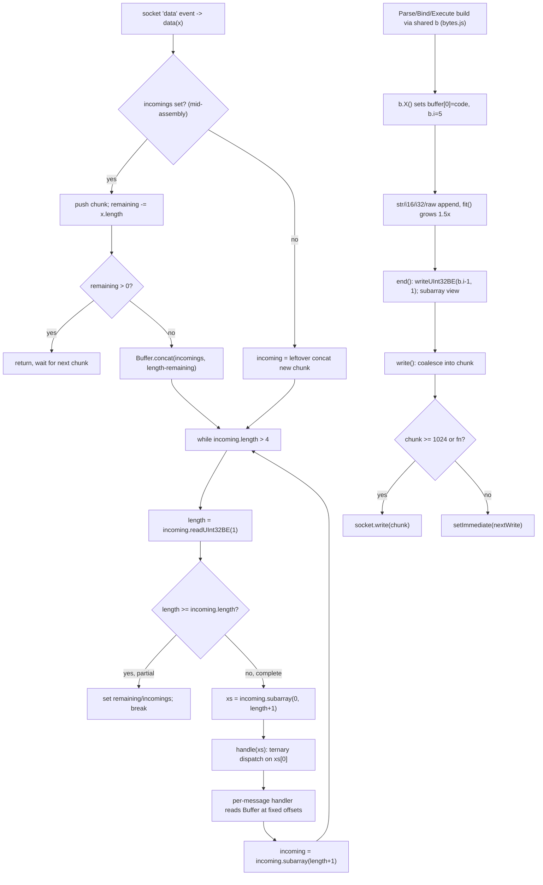

### node-postgres

Framing is a dedicated `Parser` class in `pg-protocol/src/parser.ts`. The bridge is `parse(stream, callback)` (`pg-protocol/src/index.ts:5-7`), which subscribes `stream.on('data', buffer => parser.parse(buffer, callback))`; in `pg/lib/connection.js` `attachListeners` (`connection.js:130-138`) supplies the callback that re-emits each decoded message as an EventEmitter event keyed by `msg.name`.

`Parser.parse` (`parser.ts:94-122`) maintains three cursors over a retained `this.buffer`: `bufferOffset` (start of unprocessed data), `bufferLength` (count of unprocessed bytes), so it can leave a partial trailing message in place without copying. `mergeBuffer` (`parser.ts:124-155`) appends the incoming chunk: if the leftover is empty it adopts the new buffer directly (zero-copy, `parser.ts:150-154`); otherwise it grows the backing buffer by doubling (`parser.ts:136-140`) — or shifts the remainder to offset 0 when there's room (`parser.ts:131-133`) — then copies. The frame loop (`parser.ts:98-111`) iterates while `offset + HEADER_LENGTH (5) <= bufferFullLength`: reads `code = buffer[offset]` and `length = readUInt32BE(offset+1)`, computes `fullMessageLength = 1 + length`, and only dispatches if the whole message is present, else breaks leaving the partial for the next chunk. After the loop it either resets to `emptyBuffer` (fully drained, `parser.ts:112-116`) or records the new offset/length (`parser.ts:117-121`).

Dispatch is `handlePacket` (`parser.ts:157-240`), a `switch` on `code` against the `MessageCodes` const enum (`parser.ts:53-76`). Zero-body messages (`bindComplete`, `parseComplete`, `noData`, etc.) return shared singleton objects from `messages.ts:37-73` — no allocation. Messages with bodies point the shared `BufferReader` at the slice via `reader.setBuffer(offset, bytes)` (`parser.ts:161`) and call a `parse*Message` helper (e.g. `parseDataRowMessage` `parser.ts:308-317`, `parseRowDescriptionMessage` `parser.ts:279-286`), each constructing a typed message object. `BufferReader` (`buffer-reader.ts`) is a stateful cursor with `int16/int32/uint32/string/cstring/bytes` advancing `this.offset`; `cstring` scans for the NUL terminator (`buffer-reader.ts:44-51`). Unknown codes return a `DatabaseError` rather than throwing (`parser.ts:233`).

Outbound is the `serialize` table in `serializer.ts:259-280` built on the `Writer` class (`buffer-writer.ts`). `Writer` reserves 5 header bytes (`offset` starts at 5, `buffer-writer.ts:8`), exposes `addInt32/addInt16/addCString/addString/add` with `ensure()` 1.5x growth (`buffer-writer.ts:11-21`), and `flush(code)` calls `join` which writes the code at `headerPosition` and back-patches the Int32 length as `offset - (headerPosition+1)` (`buffer-writer.ts:88-96`). Hot paths are optimized: `addInt32PrefixedString` computes `Buffer.byteLength` once (`buffer-writer.ts:67-79`); `emptyExecute`/`flushBuffer`/`syncBuffer` are pre-built constant buffers (`serializer.ts:178,252-257`); startup/SSL/cancel are written by hand with `Buffer.allocUnsafe` since they have no type-code framing (`serializer.ts:21-43,201-209`). `_send` writes straight to the stream with no userspace batching (`pg/lib/connection.js:164-168`).

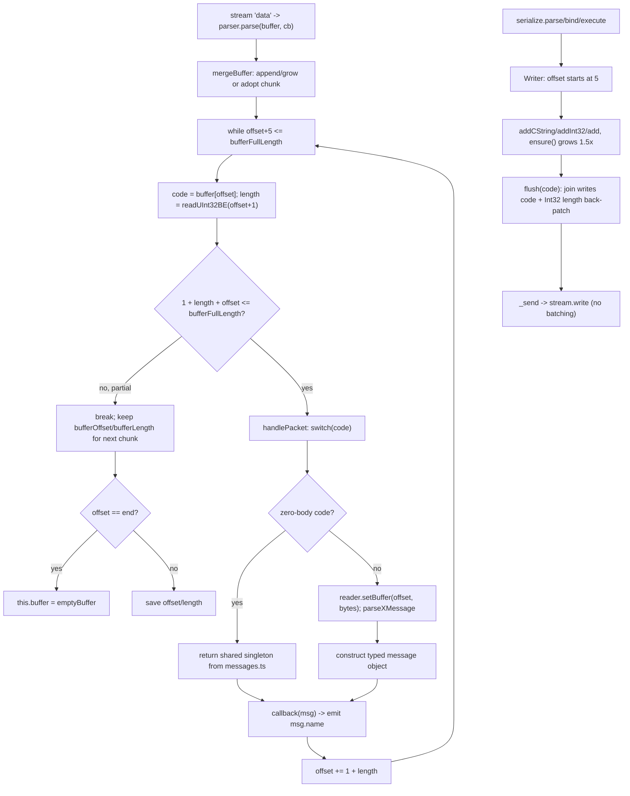

### Comparison & design takeaways for a new driver

- **Separation of concerns.** node-postgres factors framing/parsing/serialization into a reusable, unit-testable `pg-protocol` package with explicit `Parser`/`BufferReader`/`Writer` classes; postgres.js inlines everything into `connection.js` + a single global `b` builder. The pg-protocol layering is cleaner and far easier to fuzz-test; the postgres.js approach is leaner (fewer objects) but couples the protocol to the connection lifecycle.

- **Partial-packet buffering.** node-postgres's three-cursor scheme (`bufferOffset`/`bufferLength`/retained `buffer`, `parser.ts:94-155`) leaves trailing partials in place and adopts whole chunks zero-copy when nothing is pending — generally fewer copies under streaming load. postgres.js uses two strategies: a generic leftover `Buffer.concat` plus a special `incomings` array fast-path for one oversized message (`connection.js:301-332`), which avoids repeated reallocation while a single big row spans many chunks. A new driver should adopt a ring/offset scheme like pg-protocol but keep postgres.js's "accumulate-then-concat-once" idea for known-size large messages.

- **Reader strategy.** postgres.js reads fields with hard-coded offsets directly off the Buffer (`connection.js:492-512`), avoiding a reader object entirely on the hot DataRow path — fast but brittle and unreadable. node-postgres's stateful `BufferReader` is clearer but its `bytes()`/`slice()` returns views into the shared parse buffer (`buffer-reader.ts:53-57`), and the comment at `parser.ts:160` flags that a throw mid-parse retains the buffer in the reader. A new driver should prefer an explicit cursor reader but be deliberate about copy-vs-view semantics for DataRow values that outlive the parse buffer.

- **Zero-allocation wins worth stealing.** Both share singletons for empty-body backend messages (`messages.ts:37-73`) and reuse a single outbound builder. node-postgres additionally pre-bakes constant frames (`emptyExecute`, `flushBuffer`, `syncBuffer`, `serializer.ts:178,252-257`) and the one-pass `addInt32PrefixedString` (`buffer-writer.ts:67-79`) — both eliminate redundant `Buffer.byteLength` scans. A new driver should pre-compute every fixed/zero-arg frame at module load.

- **Length-field footguns.** postgres.js reads the Int32 length (`connection.js:316`) before validating the code byte and trusts it for `subarray` bounds; a corrupt/huge length is not bounds-checked. node-postgres similarly trusts `length` for slicing but at least returns a `DatabaseError` for unknown codes instead of mis-dispatching (`parser.ts:233`). A new driver should validate `length` against a sane max and against remaining bytes before slicing.

- **Write batching.** postgres.js coalesces writes in userspace (concat until ≥1024 bytes or `setImmediate` flush, `connection.js:246-258`) reducing syscalls for pipelined queries; node-postgres writes each message immediately and relies on `setNoDelay(true)` + the OS. The new driver should adopt explicit userspace coalescing (cork/uncork or a pending chunk) for pipelining throughput, but expose a flush so latency-sensitive single queries are not delayed by `setImmediate`.

- **Shared mutable global builder risk.** postgres.js's `b` is a module singleton — fine for a single-threaded, strictly-serialized writer, but reentrancy (e.g. building a second message before `end()` on the first) would corrupt state. node-postgres uses module-level `Writer` instances too (`serializer.ts:19,113`) with the same constraint. A new driver should either pool per-connection writers or make this invariant explicit.

### Verification notes
Verified against source: both Mermaid diagrams are faithful to the actual control/message flow (correct order, correct message names, no invented steps) and are valid Mermaid (render cleanly; disconnected inbound/outbound subgraphs are allowed). The vast majority of file:line citations were spot-checked and are accurate, e.g. postgres.js `data()` connection.js:301, `handle()` ternary 461, `DataRow` 492, `RowDescription` readUInt16BE(5) at 644, `write()` 246-252 / `nextWrite` 254, `bytes.js` `end(at=1)` 54-60 / `fit()` 65-73, `Bind` 948 / `Parse` 972 / `Execute` 982; node-postgres `parse()` parser.ts:94-122, frame loop 98-111, `mergeBuffer` 124-155 (zero-copy adopt, doubling-grow, shift-to-0), `handlePacket` 157 with `reader.setBuffer` at 161 and the retain-on-throw NOTE at 160, unknown-code `DatabaseError` at 233, `parseDataRowMessage` 308 / `parseRowDescriptionMessage` 279, `BufferReader.cstring` 44-51 / `bytes()` view 53-57, `Writer.ensure` 11-21 / `join` 88-96 / `addInt32PrefixedString` 67-79, `emptyExecute` serializer.ts:178 / `flushBuffer`/`syncBuffer` 252-257 / `serialize` table 259-280, pg `attachListeners` connection.js:130-138 / `_send` 164-168 / `setNoDelay(true)` 43.

Three minor (non-material) nits, not corrected because they don't affect the described mechanics:
1. Para says Writer "offset starts at 5, buffer-writer.ts:8" — the `private offset: number = 5` declaration is actually buffer-writer.ts:5; line 8 is the `Buffer.allocUnsafe(size)` call. Off-by citation only.
2. Para 52: "startup/SSL/cancel are written by hand with Buffer.allocUnsafe" is accurate for `requestSsl` (allocUnsafe(8), serializer.ts:38) and `cancel` (allocUnsafe(16), serializer.ts:201), but `startup` (serializer.ts:21) is actually built via the `Writer` class in two passes (`new Writer().addInt32(length).add(bodyBuffer).flush()`, serializer.ts:35), not allocUnsafe. The shared point (no type-code byte) still holds.
3. Comparison bullet: "Both share singletons for empty-body backend messages (messages.ts:37-73)" — returning shared singleton objects is node-postgres-only; postgres.js's empty-body handlers (`ParseComplete`/`BindComplete`, connection.js:617-623) are state-mutating functions that allocate no message object at all. The "both avoid per-message allocation" gist is correct, but postgres.js does not use singleton objects.


## Connection Pooling Lifecycle

The two drivers take fundamentally different stances. **node-postgres** ships a standalone `Pool` class (`pg-pool/index.js`) that lazily creates up to `max` `Client` objects, checks **one client out per caller** (exclusive ownership until `release()`), and manages an explicit idle list + a FIFO waiter queue. **postgres.js** has *no* pool class at all: the `Postgres()` factory pre-allocates exactly `options.max` `Connection` objects up front (`index.js:65`) and routes work through a set of "state-bucket" queues, **multiplexing/pipelining many queries onto the same live connection** rather than handing a connection to one caller. In both, a connection is always in exactly one logical state; the difference is who owns it and whether concurrency is achieved by more sockets (node-postgres) or by pipelining on fewer sockets (postgres.js).

### postgres.js

There is no `Pool` object — the pool *is* the closure inside `Postgres()` in `index.js`. State is held in eight `Queue` instances (`index.js:55-63`): `queries` (pending query waiters) plus per-connection buckets `connecting, reserved, closed, ended, open, busy, full`. Each `Connection` lives in exactly one bucket, tracked by `c.queue`; the bucket *is* the connection's state.

- **Pre-allocation, not lazy growth:** `[...Array(options.max)].map(() => Connection(...))` (`index.js:65`). Every connection starts in the `closed` bucket (`connection.js:111,125`) with no socket. Sockets are opened on demand.
- **State transition primitive:** `move(c, queue)` (`index.js:308-316`) removes `c` from its current bucket, pushes to the target, and — crucially — starts `c.idleTimer` iff the target is `open`, else cancels it.
- **Acquire path `handler(query)`** (`index.js:329-342`): if `ending` → reject; else prefer an idle conn (`open.shift()` → `go`); else open a dormant one (`closed.shift()` → `connect`); else **pipeline onto a busy conn** (`busy.shift()` → `go`); else enqueue the query in `queries`.
- **`go(c, query)`** (`index.js:344-348`): `c.execute(query)` returns truthy while the connection can still accept more pipelined work (`sent.length < max_pipeline`, `connection.js:156-177`) → `move(c, busy)`; falsy → `move(c, full)`.
- **Becoming idle `onopen(c)`** (`index.js:401-419`): called from the ReadyForQuery handler when a connection drains (`connection.js:587`) and after connect. With no waiters → `move(c, open)` (starts idle timer). With waiters it greedily drains up to `ceil(queries.length / (connecting.length + 1))` queries, distributing load across connections; handles `reserve` waiters specially.
- **Reserve / transactions:** `reserve()` (`index.js:203-232`) and `begin()` (`index.js:234-306`) pull a connection into the `reserved` bucket for exclusive, non-multiplexed use; `sql.release()` returns it via `onopen`.
- **Timers (per connection, `connection.js:75-77`, `timer()` at 1042):** `idleTimer = timer(end, idle_timeout)` started on entering `open`; `lifeTimer = timer(end, max_lifetime)` started in `connected()` (`connection.js:371`), default randomized 30-60 min to avoid a thundering herd (`index.js:515-517`); `connectTimer = timer(connectTimedOut, connect_timeout)` started in `connect()` (`connection.js:343`), cancelled on first ReadyForQuery (`connection.js:552`).
- **Close, reconnect, backoff:** `closed()` (`connection.js:436-458`) cancels all timers, nulls the socket; if an `initial` connect query is still pending it reconnects immediately, otherwise computes an exponential-jitter `delay` (`backoff`, `index.js:511-513`) and calls `onclose`. `onclose(c)` (`index.js:421-427`) moves the conn back to `closed` and, if queries are waiting, immediately reconnects with the next one. Multi-host failover rotates `hostIndex` (`connection.js:354-358`) and honors `target_session_attrs` (`connection.js:555-559`).
- **Shutdown:** `end({timeout})` (`index.js:365-378`) races every `c.end()` against a `destroy` timer; `destroy()` (`index.js:384-389`) terminates all sockets and rejects every still-queued query with `CONNECTION_DESTROYED`.

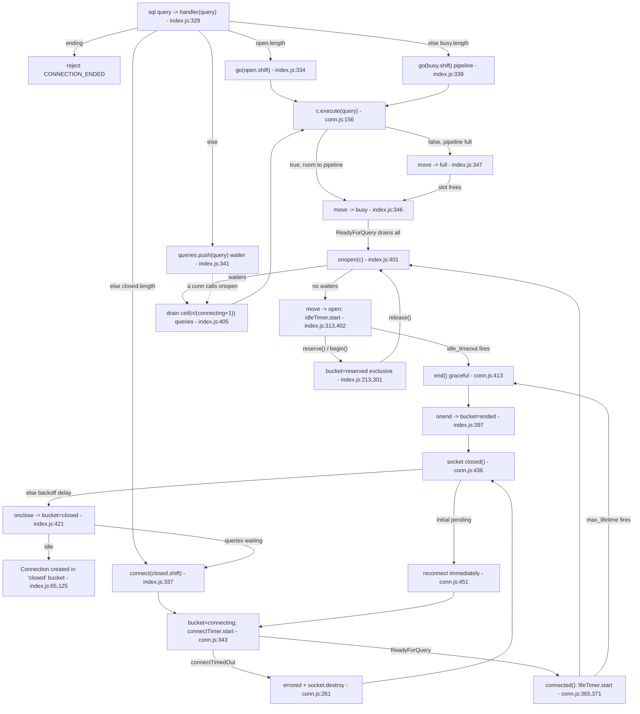

### node-postgres

`pg-pool/index.js` is a real `Pool extends EventEmitter`. Core state (`index.js:102-108`): `_clients` (all live clients), `_idle` (array of `IdleItem`, used **LIFO**), `_pendingQueue` (array of `PendingItem` waiters, used **FIFO**), `_expired` (WeakSet for lifetime-evicted clients). Ownership is exclusive: a caller gets a `client` and must call `client.release()`.

- **Acquire `connect(cb)`** (`index.js:190-238`): rejects if `ending`. If the pool is full (`_clients.length >= max`) or has idle clients, it pushes a `PendingItem` waiter onto `_pendingQueue` (optionally wrapped with a `connectionTimeoutMillis` timer that removes the waiter and rejects with `"timeout exceeded"`, `index.js:219-225`) and schedules `process.nextTick(_pulseQueue)` if idle exists. Otherwise it calls `newClient` directly.
- **Scheduler `_pulseQueue()`** (`index.js:127-170`): the heart of the machine. If `ended` → noop. If `ending` → evict all idle and fire `_endCallback` once `_clients` is empty. If no waiters → noop. If no idle **and** full → noop (waiters block). Else `shift()` a waiter (FIFO) and either `pop()` an idle client (LIFO, clears its idle timer, `ref()`s it) → `_acquireClient(isNew=false)`, or if not full → `newClient`.
- **Create `newClient`** (`index.js:240-309`): `new Client`, push to `_clients`, build a `makeIdleListener`. A `connectionTimeoutMillis` timer destroys the stream / ends the client on timeout (`index.js:250-263`). On `client.connect` error → remove from `_clients`, `_pulseQueue`, reject waiter (wrapping as `"Connection terminated due to connection timeout"` if it timed out). On success → optional `onConnect` hook, then `_afterConnect`.
- **`_afterConnect`** (`index.js:311-332`): if `maxLifetimeSeconds`, arm an `unref`'d timer that adds the client to `_expired` and force-acquires+releases it to evict. Then `_acquireClient(isNew=true)`.
- **Hand-off `_acquireClient`** (`index.js:335-366`): emit `connect` (if new) + `acquire`, install `client.release = _releaseOnce(...)`, **remove the idle error listener** (so a mid-use error flows to the query, not pool eviction), optional `verify`, then invoke the waiter callback with `(client, release)`.
- **Check-in `_release`** (`index.js:384-429`): re-attach idle listener, bump `_poolUseCount`, emit `release`. Evict via `_remove` if `err || ending || !client._queryable || client._ending || _poolUseCount >= maxUses` (`index.js:392`) or if `_expired`. Otherwise, if `idleTimeoutMillis` and **above min** (`_isAboveMin`, `index.js:123`), arm a per-client idle timer to `_remove`; push an `IdleItem` and `_pulseQueue()`. Min connections never idle-time-out.
- **Eviction `_remove`** (`index.js:172-188`): pull from `_idle` (clearing its timer), filter out of `_clients`, `client.end()`, emit `remove`. `makeIdleListener` (`index.js:51-64`) auto-removes a client that errors *while idle* and re-emits as a pool `error`.
- **Double-release guard:** `_releaseOnce` (`index.js:369-380`) throws on a second `release()`.
- **Shutdown `end(cb)`** (`index.js:488-499`): set `ending`, `_pulseQueue()`; the ending branch drains idle and resolves once all clients are gone.

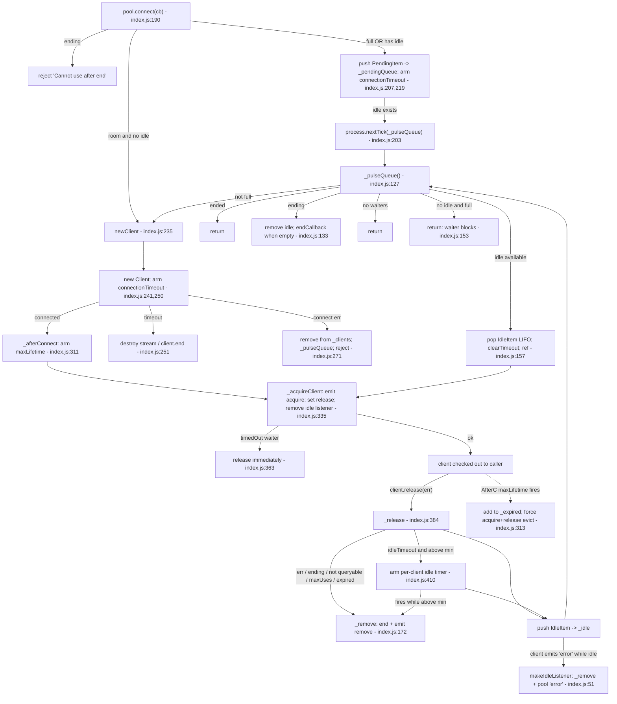

### Comparison and design takeaways for a new driver

- **Concurrency model is the core divergence.** node-postgres = *N sockets, one caller each*; raw concurrency is bounded by `max` and a slow query holds its whole client. postgres.js = *fewer sockets, pipelined* — `handler` will stack queries onto a `busy` connection (`index.js:339`) and `execute` keeps returning true until `max_pipeline` (`connection.js:176`), so it sustains high throughput with far fewer connections. A new driver should pick deliberately; pipelining is a major latency win for read-heavy OLTP but complicates transaction/`reserve` semantics (postgres.js needs the whole `reserved` bucket + `UNSAFE_TRANSACTION` guard at `connection.js:605` precisely because multiplexing and `BEGIN` don't mix).
- **Lazy vs eager allocation.** postgres.js pre-creates `max` connection *objects* but opens sockets lazily; node-postgres creates clients lazily on demand. Eager objects + lazy sockets (postgres.js) gives a fixed, allocation-free steady state and trivial round-robin, but always materializes `max` JS objects. node-postgres's pure-lazy growth is leaner at low load. Adopt postgres.js-style "object pool, lazy socket" if you want predictable memory and simple scheduling.
- **State representation.** postgres.js's "the bucket *is* the state, `move()` is the only transition" (`index.js:308`) is elegant and audit-friendly — one invariant (a conn is in exactly one queue) replaces a pile of boolean flags. node-postgres leans on scattered flags (`_queryable`, `_ending`, `_connecting`, `_expired`, `_poolUseCount`) checked ad hoc in `_release` (`index.js:392`); cleaner but more error-prone. A new driver should adopt an explicit state enum/bucket model.
- **Idle reuse order.** node-postgres pops idle **LIFO** (`index.js:158`) so a hot subset stays warm and the cold tail idle-times-out — good for shrinking back toward `min`. postgres.js's `onopen` distributes by `ceil(n/(connecting+1))` (`index.js:405`). LIFO + min-floor is a nice default to copy.
- **Timeouts: watch the footguns.** node-postgres idle timeout only fires *above min* (`_isAboveMin`, `index.js:409`) — `min` connections live forever; document this. There are *two* separate `connectionTimeoutMillis` paths (waiting for an existing client at `index.js:219` vs creating a new one at `index.js:250`) that are easy to confuse. postgres.js randomizes `max_lifetime` 30-60 min (`index.js:515`) to prevent synchronized reconnect storms — adopt jittered lifetimes; also adopt its jittered exponential `backoff` (`index.js:511`).
- **Error eviction.** Both detach the idle/error listener during checkout and reattach on release so an in-flight error reaches the query rather than nuking the pool (node-postgres `index.js:344,385`; postgres.js routes via `queryError`). node-postgres additionally auto-evicts a client that errors while sitting idle (`makeIdleListener`, `index.js:51`). A new driver must handle "errored while idle" explicitly — don't hand out a dead socket.
- **Backpressure / waiter bounds.** Neither caps the waiter queue: node-postgres `_pendingQueue` and postgres.js `queries` both grow unboundedly under overload (only node-postgres offers a per-waiter `connectionTimeoutMillis` escape hatch). A new driver should expose a max-queue-depth / acquire-timeout to fail fast instead of leaking memory.
- **Safety niceties to keep:** double-release throws (`_releaseOnce`, `index.js:369`); password/ssl key hidden from stack traces (`index.js:71-87`); graceful `end` that drains idle then resolves (`_pulseQueue` ending branch, `index.js:133`). postgres.js's `end({timeout})` racing graceful close against a hard `destroy` (`index.js:365-389`) is a cleaner shutdown contract than node-postgres's drain-only `end`.

### Verification notes
Verified against source; diagrams faithful and valid Mermaid. Spot checks:
- postgres.js: `connections = [...Array(options.max)].map(...)` at index.js:65; eight Queue buckets at index.js:55-63; `move()` idle-timer logic at index.js:308-316; `handler` acquire order open->closed->busy->queue at index.js:329-342; `go` busy/full at 344-348; `onopen` drain `ceil(queries.length/(connecting.length+1))` at index.js:405; reserve 203-232, begin 234-306, end 365-378, destroy 384-389, onclose 421-427, onend 397. UNSAFE_TRANSACTION guard at connection.js:605; execute pipeline cutoff `sent.length < max_pipeline` at connection.js:176; connectTimedOut errored+socket.destroy at conn.js:261; lifeTimer.start at 371, connectTimer.start at 343, connectTimer.cancel at 552; closed()/reconnect at 436-458/451; onopen called from ReadyForQuery at conn.js:587; timer() at 1042; max_lifetime jitter 30-60min at index.js:515-517, backoff at 511-513. All accurate.
- node-postgres: state fields at index.js:102-108; connect 190-238 (timeout-waiter reject "timeout exceeded" 219-225, nextTick pulse 203, newClient direct 235); _pulseQueue 127-170 (ended/ending/no-waiter/full-noidle branches, LIFO pop at 158, FIFO shift at 156); newClient 240-309 (conn-timeout destroy 250-263, connect-err remove+reject 271-284); _afterConnect maxLifetime 311-332; _acquireClient 335-366 (remove idle listener 344); _release 384-429 (evict predicate 392, _isAboveMin idle arm 409); _remove 172-188; makeIdleListener 51-64; _releaseOnce 369-380; end 488-499. All accurate.

Minor, non-material abstractions (not errors): (1) postgres.js diagram edge `Connected --> OnOpen` elides that a freshly connected conn first runs its `initial` query (connection.js:567) and only reaches `onopen` on the next ReadyForQuery; the prose "after connect" is likewise loose. (2) In `connect()` the `process.nextTick(_pulseQueue)` is scheduled just before the `_pendingQueue.push`, whereas the diagram orders Push then Tick - functionally equivalent. (3) node-postgres `_afterConnect` lifetime timer only force-acquires+releases when the client is currently idle (idleIndex !== -1); otherwise eviction defers to the `isExpired` check in `_release` - the text/diagram present the evict path without this conditional. None affect correctness of the described control flow.


## Type Serialization & Parsing Pipeline

Both drivers map JS values to wire bytes on the way in and OID-keyed parsers to JS values on the way out, but they differ sharply in ownership and format strategy. postgres.js ships its **own** tiny type system in `types.js` (a `types` registry compiled into `serializers`/`parsers` OID maps) and is essentially **text-format-only** on the wire in both directions. node-postgres delegates parsing to the **external `pg-types` package** behind a thin `TypeOverrides` shim, serializes params via `utils.prepareValue`, and supports **per-value binary params** (any `Buffer` arg) plus opt-in **binary result rows**. In both, "custom types" reduce to inserting a function into an OID→fn map; the interesting design questions are *where* arrays, JSON, and user overrides plug in.

### postgres.js

Serialization (outbound):
- A user-facing type record has shape `{ to, from, serialize, parse }` (`types.js:4-40`). `typeHandlers` (`types.js:201-210`) flattens these into two OID-keyed maps: `serializers[to]` and `serializers[from...]` get the `serialize` fn; `parsers[from...]` get the `parse` fn. `mergeUserTypes` (`types.js:193-199`) `Object.assign`s user records over the defaults, and `index.js:499` folds the result into per-connection `options`.
- Param OIDs are chosen by `handleValue` (`types.js:75-94`) which calls `inferType` (`types.js:220-230`): `Date→1184`, `Uint8Array→17`, bool`→16`, `bigint→20`, arrays recurse on element 0, else `0` (unknown). A `Parameter` wrapper (`types.js:51`) lets callers force a `type`/`array` OID.
- The actual bytes are written in `connection.js Bind` (`connection.js:948-970`): for each param, `type in options.serializers ? serializers[type](x) : '' + x`, then `b.str(x)` — **every value is sent as a text string** (format code never set to binary).
- Arrays: `addArrayType` (`connection.js:781-787`) lazily registers, for an element OID and its `typarray`, `serializers[typarray] = xs => arraySerializer(xs, serializers[oid], …)` and a matching `parsers[typarray]` flagged `.array = true`. `arraySerializer` (`types.js:241-266`) builds the `{…}` literal with quoting/escaping (`;` delimiter only for `_box`/1020).

Parsing (inbound):
- `RowDescription` (`connection.js:636-666`) stamps each column with `parser: parsers[type]` looked up by the field's type OID.
- `DataRow` (`connection.js:492-524`) reads each cell as `x.toString('utf8', …)`, then: no parser → raw string; `parser.array===true` → array parser on the slice (skipping the leading byte); else `parser(text)`. JSON/camel transforms run via `transform.value.from` (`createJsonTransform`, `types.js:338-346`).

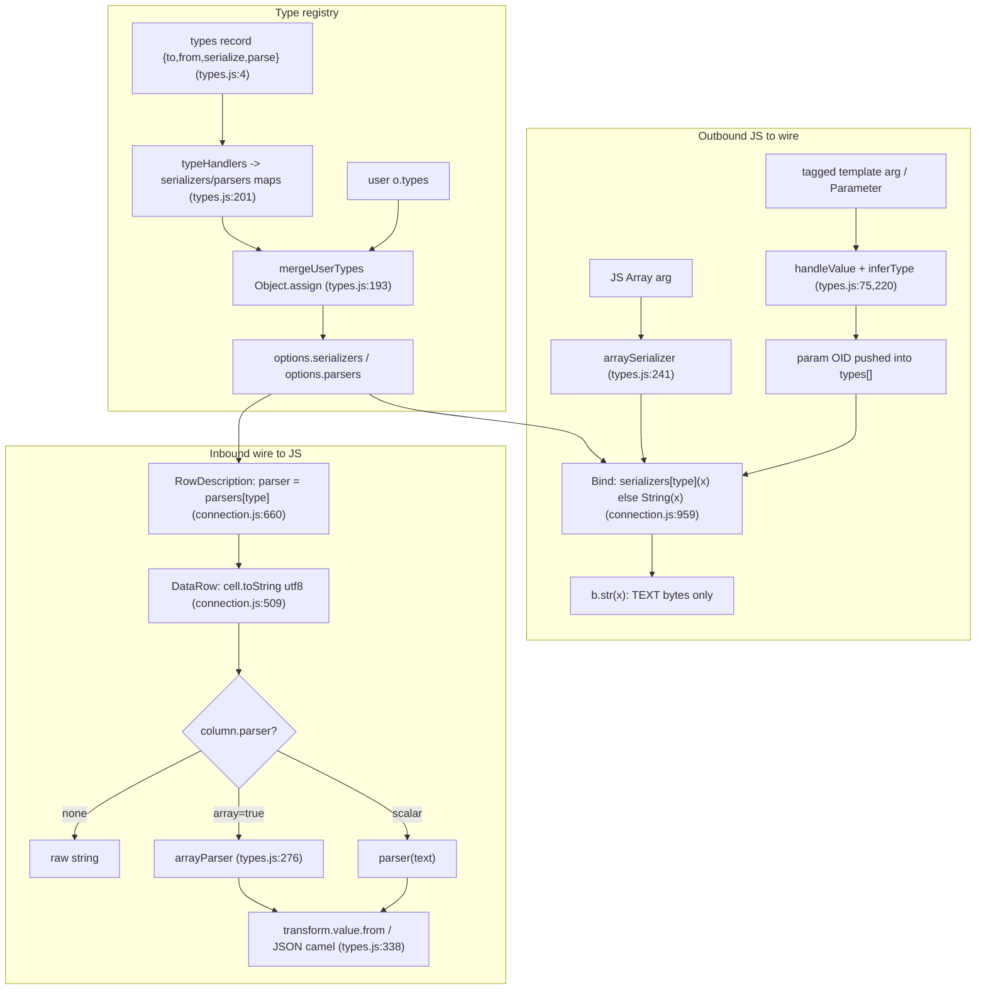

### node-postgres

Serialization (outbound):
- Driver owns no scalar serializers; `query.js prepare` passes `valueMapper: utils.prepareValue` to `connection.bind` (`query.js:228`). `prepareValue` (`utils.js:44-83`) handles `null`, `Buffer`/TypedArray (passed through), `Date` (`dateToString[UTC]`, gated by `defaults.parseInputDatesAsUTC`), `Array→arrayString`, objects with `.toPostgres()`, else `JSON.stringify`, else `String(val)`.
- Wire framing in `serializer.ts writeValues` (`serializer.ts:121-142`): the **per-value format code is binary (1) iff the mapped value is a `Buffer`**, otherwise string (0). So a `Buffer` arg is the only way to send a binary param; everything else is text. The query-level `binary` flag only sets the single **result** format code (`serializer.ts:166-170`).

Parsing (inbound):
- `parseField` (`parser.ts:288-296`) reads each column's `format` as `int16()===0 ? 'text' : 'binary'` and its `dataTypeID`.
- `Result.addFields` (`result.js:82-106`) precomputes `this._parsers[i] = this._types.getTypeParser(desc.dataTypeID, desc.format || 'text')` and builds a prototype-less empty row object.
- `TypeOverrides` (`type-overrides.js`) is the override seam: it keeps separate `text`/`binary` OID maps; `setTypeParser(oid, format, fn)` writes into one (`type-overrides.js:22-28`), `getTypeParser` returns the override **or falls back to `pg-types.getTypeParser`** (`type-overrides.js:30-33`). Overrides can be global (the `pg-types` singleton) or per-`Client` (`client.js:77`, `client._types`).
- `Result.parseRow` (`result.js:63-76`) applies `_parsers[i]` per cell, wrapping binary-format cells in `Buffer.from`. `pg-types` (external) supplies the default text+binary parsers, including its own array parsers.

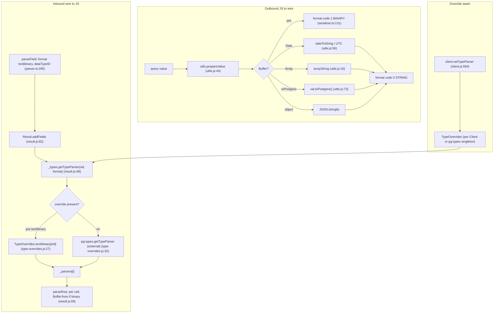

### Comparison & design takeaways for a new driver

- **Ownership of parsers.** postgres.js bundles a deliberately minimal registry (6 scalar families) in-tree; node-postgres outsources the full OID catalog to `pg-types`. The in-tree approach is leaner and dependency-free but knows fewer types by default (unknown OIDs fall through to raw strings via `inferType→0` and `parser===undefined`); `pg-types` is comprehensive but is an external moving part. A new driver should own a *core* registry yet expose a clean extension point.
- **Format strategy.** postgres.js is effectively **text-only both directions** — simple and uniform, but forfeits binary's speed/precision (e.g. it stringifies/`+x` numerics). node-postgres is text-by-default with **opportunistic binary params (Buffer)** and **opt-in binary result rows** (`query.binary`), plus per-column format awareness. Neither negotiates binary per-OID automatically. A new driver could adopt per-OID binary codecs (int/float/uuid/timestamp) for real wins, which both leave on the table.
- **Override ergonomics.** node-postgres's `TypeOverrides` cleanly separates `text`/`binary` maps and supports both global and per-connection overrides with `pg-types` fallback — the cleaner, more discoverable seam. postgres.js's override is just `Object.assign` of user records keyed by `to`/`from` OIDs (`mergeUserTypes`), which is terse but couples serialize+parse and silently lets a `from` OID double as a serializer key (`types.js:206`).
- **Array handling.** postgres.js implements its own array serializer/parser and *lazily* discovers `typarray` OIDs from the server (`connection.js:771-787`); node-postgres relies on `pg-types`'s array parsers and a recursive `arrayString` for output. The lazy `typarray` discovery is elegant but adds a roundtrip/bootstrap query — a new driver should ship a static element-OID↔array-OID table instead.
- **Footguns visible in code.** (1) postgres.js `arrayParser` uses a single **module-level mutable `arrayParserState`** (`types.js:268`) — not reentrant; fine only because parsing is synchronous per-row. (2) postgres.js `inferType` keys off element 0 of an array, so heterogeneous/empty arrays mis-infer (`types.js:227`). (3) node-postgres's "binary iff Buffer" rule means a `bytea` is the *only* implicitly-binary param; everything else round-trips through strings. (4) node-postgres `prepareObject` falls back to `JSON.stringify` for *any* unknown object (`utils.js:82`), which can silently produce wrong wire text for non-JSON types lacking `.toPostgres()`.
- **Adopt / avoid.** Adopt node-postgres's split text/binary override registry with per-connection scoping and a typed fallback chain. Adopt postgres.js's dependency-free core registry and its `transform` hooks (camel/JSON, `types.js:338`). Avoid global mutable parser state; make array codecs reentrant and table-driven. Prefer explicit per-OID binary codecs over the all-text default both drivers settle for.

### Verification notes
Verified: diagrams faithful to source, valid Mermaid. Adversarial re-read of all cited source confirms the control/message flow.

Spot-checks (all confirmed):
- postgres.js `types` record shape and OID maps: types.js:4-40, `typeHandlers` 201-210, `mergeUserTypes` 193-199, `inferType` 220-230 (Date->1184, Uint8Array->17, bool->16, bigint->20, array recurse on el0, else 0), `Parameter` ctor 51-58. `index.js:499` spreads `mergeUserTypes(o.types)` into options. Confirmed.
- Bind text-only: connection.js:948-970; param-format-count `i16(0)` at line 952 => all params text; serialize at 959-961 (`type in options.serializers ? serializers[type](x) : '' + x`); write `.str(x)` at 964. Confirmed.
- `addArrayType` 781-788 lazily sets `serializers[typarray]`/`parsers[typarray]` (`.array = true`) from `fetchArrayTypes` typarray query 768-779. `arraySerializer` 241-266 with `;` delimiter only for 1020. Confirmed.
- RowDescription `parser: parsers[type]` at connection.js:660; DataRow 492-524 with `x.toString('utf8', index+1, ...)` (skip leading byte) for `.array===true` at line 511; `transform.value.from` / `createJsonTransform` 338-346. Confirmed.
- node-postgres `prepareValue` utils.js:44-83 (null, Buffer/TypedArray passthrough, Date gated by `defaults.parseInputDatesAsUTC`, Array->arrayString, toPostgres, else JSON.stringify; non-object `val.toString()` at 69); `arrayString` at 16. Confirmed.
- `writeValues` serializer.ts:121-142, BINARY iff Buffer at 129-134 (format 1 line 131); single result format code 166-170 from query-level `binary`. Confirmed.
- `parseField` parser.ts:288-297, format `int16()===0 ? 'text' : 'binary'` at 295, dataTypeID at 292. Confirmed.
- `Result.addFields` 82-106 precomputes `_parsers[i] = _types.getTypeParser(oid, format||'text')` (99/101), prototype-less row via `Object.create(null)` (92); `parseRow` 63-76 wraps binary cells in `Buffer.from` (69). Confirmed.
- `TypeOverrides` type-overrides.js: setTypeParser 22-28, getTypeParser override-or-fallback 30-33; per-Client `this._types = new TypeOverrides(c.types)` at client.js:77; `setTypeParser` 584-585; `query.js:228` passes `valueMapper: utils.prepareValue` to `connection.bind`. Confirmed.

Minor (non-blocking) nits, no edit needed:
- Line 9 prose has a cosmetic stray-backtick typo ("bool`->16`"); not a Mermaid/content error.
- type-overrides fallback target is precisely `this._types.getTypeParser` where `this._types = userTypes || pg-types`; the diagram label "pg-types.getTypeParser (external)" describes the default singleton case and is accurate for the global path.
- Diagram-2 node `OVR["TypeOverrides.text/binary[oid] ..."]` contains `[oid]` inside a double-quoted label; Mermaid handles brackets within quoted text, so it renders.


## Prepared Statements & Statement Caching

Both drivers map a query onto Postgres' extended protocol (`Parse`/`Bind`/`Describe`/`Execute`) and keep a per-connection map of statements already `Parse`d on the wire, so subsequent executions can skip re-parsing. The fundamental difference is policy: **postgres.js prepares everything by default** (`prepare: true`, `src/index.js:458`), auto-generating a unique statement name per distinct query and caching it under a content-derived signature; **node-postgres prepares only when asked** and never invents names — the caller must pass `config.name`, otherwise the statement is sent unnamed (re-parsed every time). postgres.js also auto-recovers from server-side cached-plan invalidation by deallocating and re-preparing; node-postgres does not.

### postgres.js

Caching state lives on each `Connection` closure: `statements = {}` (the cache), `statementId = Math.random().toString(36).slice(2)` (a random per-connection prefix) and `statementCount = 1` (`src/connection.js:86-88`). All three are reset every time the socket (re)connects in `connected()` (`src/connection.js:367-369`), so names never leak across physical connections.

`build(q)` (`src/connection.js:224-244`) decides everything per execution:
- `q.prepare = options.prepare && ('prepare' in q.options ? q.options.prepare : true)` (`:232`) — global default is `true`; `.simple()` / `.readable()` force it `false` (`src/query.js:56-66`).
- `q.signature = q.prepare && types + string` (`:234`) — the cache key is the concatenation of the inferred type-OID array and the SQL string.
- `q.onlyDescribe && (delete statements[q.signature])` (`:235`) — `.describe()` evicts so the statement is re-prepared.
- `q.prepared = q.prepare && q.signature in statements` (`:237`) — cache hit test.
- `q.describeFirst = q.onlyDescribe || (parameters.length && !q.prepared)` (`:238`) — if there are params and no cache hit, do a describe round-trip first to learn parameter types.
- `q.statement = q.prepared ? statements[q.signature] : { string, types, name: q.prepare ? statementId + statementCount++ : '' }` (`:239-241`) — **name generation**: a cache miss with `prepare` on mints `statementId + statementCount++` (e.g. `"k3j9f1"` + `1`); with `prepare` off the name is `''` (unnamed).

`toBuffer(q)` (`src/connection.js:185-198`) serializes the right message bundle: simple `Query`; or `describe(q)+Flush` when `describeFirst`; or `prepared(q)` alone (`Bind`+`Execute`) on a cache hit; or `describe(q)+prepared(q)` (`Parse`+`Describe 'S'`+`Bind`+`Execute`) for a no-param cache miss; or `unnamed(q)` (`Parse` with empty name + `DescribeUnnamed` + `Bind`+`Execute`).

The statement is **inserted into the cache** only after the server confirms it, in `ParameterDescription` (`src/connection.js:632`): `query.prepare && (statements[query.signature] = query.statement)`; the next line writes the deferred `Bind`/`Execute` when `describeFirst` was used (`:633`). Columns are filled in later by `RowDescription`/`NoData`.

**Re-prepare / deallocate**: `ReadyForQuery` checks for a server error whose `routine` is in `retryRoutines` = `{FetchPreparedStatement, RevalidateCachedQuery, transformAssignedExpr}` (`src/connection.js:25-29, 538-541`). If the failed query was `prepared`, it calls `retry(q, error)` which does `delete statements[q.signature]; q.retried = error; execute(q)` (`src/connection.js:821-825`) — i.e. evict and re-prepare once. There is no explicit `DEALLOCATE`/`Close 'S'` for normal statements; they live for the connection's lifetime (Close is only used for cursor portals, `:989`).

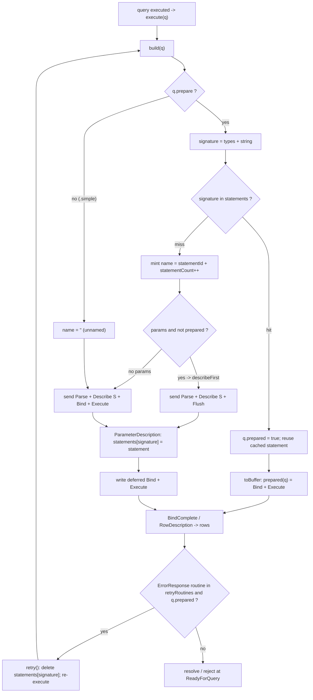

### node-postgres

State is `connection.parsedStatements = {}`, one plain object per `Connection` (`pg/lib/connection.js:26`), mapping statement name -> the SQL text it was parsed with.

A `Query` only uses the extended/prepared path if `requiresPreparation()` returns true (`pg/lib/query.js:35-58`): when `queryMode === 'extended'`, OR `this.name` is set, OR `this.rows` (row-paged cursor), OR there are bound `values`. Otherwise `submit()` falls back to a plain simple `Query` message (`pg/lib/query.js:179-181`). **There is no automatic name generation** — `this.name = config.name` comes straight from the caller (`pg/lib/query.js:18`); with no name the statement is parsed with an empty name (unnamed) and is therefore never cached.

`submit()` (`pg/lib/query.js:152-183`) guards the cache before preparing: `previous = connection.parsedStatements[this.name]`; if `this.text` differs from `previous` it returns the error `"Prepared statements must be unique - '<name>' was used for a different statement"` (`:156-159`). It corks the stream, then calls `prepare()`.

`prepare()` (`pg/lib/query.js:209-245`): if `!hasBeenParsed(connection)` it emits `connection.parse({text, name, types})`; `hasBeenParsed` is simply `this.name && connection.parsedStatements[this.name]` (`:185-187`). So a named statement is `Parse`d at most once per connection; on later executions only `Bind`/`Describe 'P'`/`Execute` go out. The cache is **populated on `ParseComplete`** in the client, not the query: `_handleParseComplete` sets `connection.parsedStatements[activeQuery.name] = activeQuery.text` only when the query has a name (`pg/lib/client.js:491-504`).

The serializer warns (does not error) if a name exceeds Postgres' 63-char limit (`pg-protocol/src/serializer.ts:80-84`). On a `bind` error, `prepare()` issues `connection.close({type:'S', name})` + `sync()` to deallocate the half-prepared statement and avoid leaking it (`pg/lib/query.js:230-237`). There is **no automatic re-prepare** on server-side plan invalidation and **no cache eviction** — entries persist for the connection's life (or are cleared by the pool discarding the connection).

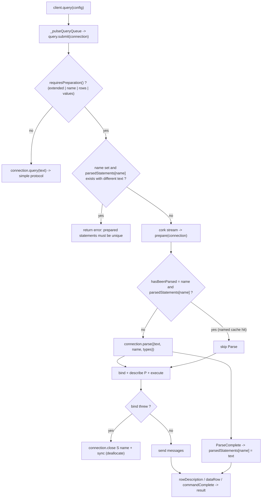

### Comparison & design takeaways for a new driver

- **Prepare policy.** postgres.js prepares by default and names statements automatically; node-postgres prepares only on `name`/`values`/`rows` and never names for you. postgres.js gives "fast by default" with zero caller effort; node-postgres is explicit but forces users to manage names to get caching. A new driver should lean toward postgres.js' automatic-prepare-and-cache, gated by a single config flag.
- **Cache key.** postgres.js keys the cache by `types + string` (`connection.js:234`) — content-addressed, so identical SQL automatically dedupes regardless of any name. node-postgres keys by the caller-supplied `name` and only validates that text matches (`query.js:156`). Content-addressing is the cleaner model: it eliminates the "two different SQLs reused the same name" footgun entirely. A new driver should hash the SQL+param-types itself and never expose raw names.
- **Name generation.** postgres.js' `statementId(random) + statementCount++` (`connection.js:241`) is collision-safe across connections and trivially cheap. node-postgres pushing 63-char-limit responsibility onto users (only a `console.error` warning, `serializer.ts:81`) is a footgun — adopt postgres.js-style short generated names.
- **Plan-invalidation recovery.** postgres.js auto-detects `FetchPreparedStatement`/`RevalidateCachedQuery`/`transformAssignedExpr` errors, evicts, and re-prepares once (`connection.js:25-29, 538, 821`). node-postgres surfaces the error to the user. The automatic retry is a real robustness win (schema changes / search_path shifts no longer break long-lived pooled connections) and should be adopted — but bound it to a single retry to avoid loops.
- **Unbounded growth.** Neither driver evicts: postgres.js' `statements` map and node-postgres' `parsedStatements` grow with every distinct query string for the connection's lifetime. An app with high-cardinality/dynamically-built SQL leaks server-side prepared statements and client memory. A new driver should add an LRU bound with real `Close 'S'`/`DEALLOCATE` on eviction (today only cursor portals and bind-errors are closed — `connection.js:989`, `query.js:232`).
- **Cache-insert timing.** Both insert only after server confirmation (postgres.js on `ParameterDescription`, node-postgres on `ParseComplete`), which correctly avoids caching a statement that failed to parse — keep this invariant.
- **Pooler hazard.** Named prepared statements are incompatible with PgBouncer transaction/statement pooling; postgres.js' always-on naming makes this a sharper edge (mitigated only by setting `prepare: false`, `index.js:442`). A new driver should detect or document this and make "unnamed extended protocol" a first-class mode rather than an all-or-nothing switch.

### Verification notes
Verified: diagrams faithful to source, valid Mermaid. All file:line citations confirmed accurate:
- postgres.js: `statements/statementId/statementCount` (connection.js:86-88), reset in `connected()` (367-369), `build()` (224-244) incl. signature `types+string` (234), prepared test (237), describeFirst (238), name minting (239-241); `toBuffer()` dispatch (185-198); cache insert on `ParameterDescription` (632-633); `retryRoutines` set (25-29); ReadyForQuery retry dispatch (538-541); `retry()` evict+re-execute (821-825); `Close` is portal-only (989-993); `prepare:true` default (index.js:458), `no_prepare` (index.js:442), `.simple()` forces prepare false (query.js:56-66).
- node-postgres: `parsedStatements={}` (connection.js:26), `name=config.name` (query.js:18), `requiresPreparation()` (35-58), `submit()` + uniqueness error (152-183, 156-159), `hasBeenParsed` (185-187), `prepare()` parse/bind/describe-P/execute + close-on-bind-error (209-245, 230-237), simple-protocol fallback (179-181), cache populated on `_handleParseComplete` only when named (client.js:491-504, 501-502), 63-char warning is `console.error` not error (serializer.ts:80-84).

Minor (non-blocking) imprecisions, no edit needed:
- Diagram 1: the unnamed branch (`U -> K -> L`) is simplified. The true unnamed path is only reached for `prepare:false` with NO params (global `no_prepare`); with params, `describeFirst` is true and it takes the describe+Flush path instead. Also `ParameterDescription` only writes the cache when `query.prepare` is truthy (connection.js:632), so an unnamed (`prepare:false`) statement reaching node L would NOT actually be cached — the diagram glosses this. The wire-level Parse+Describe'S'+Bind+Execute shape shown for K is nonetheless accurate (`unnamed()` uses `DescribeUnnamed` = Describe 'S' empty-name, connection.js:22/216-222).
- Prose at :17 correctly distinguishes all five `toBuffer` branches; diagram compresses them, which is acceptable for an overview.


## Cursors, Streaming & Backpressure

Both drivers stream large result sets through the extended-query protocol: open a portal with `Bind`, then issue `Execute` messages carrying a **max-row count** so the server returns a chunk and answers `PortalSuspended` instead of `CommandComplete`. The fetch loop re-issues `Execute` until the server reports `CommandComplete`, at which point the portal is closed and `Sync` flips the connection back to `ReadyForQuery`. node-postgres exposes this as a low-level `pg-cursor` (`read(n, cb)`) wrapped by a `pg-query-stream` Node `Readable`; postgres.js builds it directly into the tagged-template `Query` via `.cursor(rows, fn)` / `.forEach(fn)` (`src/query.js`) and drives the loop from the protocol handler in `src/connection.js`. Large objects (`src/large.js`) and `COPY` are a separate path that layer Node streams over server-side functions / `CopyData` frames.

### postgres.js

`.cursor(n, fn)` and `.forEach(fn)` are methods on the `Query` (`src/query.js:74` and `:123`). `.cursor` forces `simple = false` (`query.js:75`) and stores `cursorRows` + `cursorFn`; with no callback it instead returns an async-iterator whose `next()` installs a fresh `cursorFn` that resolves the iterator value and returns a *new* promise stored in `prev` (`query.js:88-104`) — the server fetch loop blocks on that promise until the consumer pulls again, giving native `for await` backpressure. `.forEach` just sets `forEachFn` and calls `handle()` (`query.js:123-127`).

Wire building lives in `src/connection.js`. `build()` decides `prepare`/`prepared` (`connection.js:224-244`); `prepared()` emits `Bind` then, **only when `cursorFn` is set**, `Execute('', q.cursorRows)` — otherwise `ExecuteUnnamed` (row limit 0 = all rows) (`connection.js:207-214`). The cursor uses the **unnamed portal** `''`. `Execute()` is `E + portal + rows` followed by `Flush` (no `Sync`) (`connection.js:982-987`), so the server streams a chunk and stops at `PortalSuspended`. Each `DataRow` is parsed and, for `.forEach`, dispatched immediately via `forEachFn(row, result)` instead of being accumulated (`connection.js:521-523`). On `PortalSuspended` (`connection.js:839-850`) the driver `await`s `query.cursorFn(result)`; if the callback returns the `CLOSE` sentinel it writes `Close(portal)`, otherwise it allocates a fresh `Result` and writes another `Execute('', q.cursorRows)` to fetch the next chunk. `CommandComplete` (last partial chunk) calls `cursorFn(result)` once more and writes `Sync` (`connection.js:608-614`); `CloseComplete` resolves the query (`connection.js:852-855`).

`COPY` and large objects are distinct: `readable()`/`writable()` set `streaming=true` (`query.js:62-72`) and the protocol layer resolves a Node `Stream` on `CopyOutResponse`/`CopyInResponse`/`CopyBothResponse`; `CopyData` does `stream.push(chunk) || socket.pause()` for true socket backpressure (`connection.js:906-908`). `src/large.js` wraps server-side `lo_*` functions inside `sql.begin`, returning `Stream.Readable`/`Writable` whose `read()`/`write()` await `loread`/`lowrite` queries with a default `highWaterMark` of `2048*8` (`large.js:36-67`).

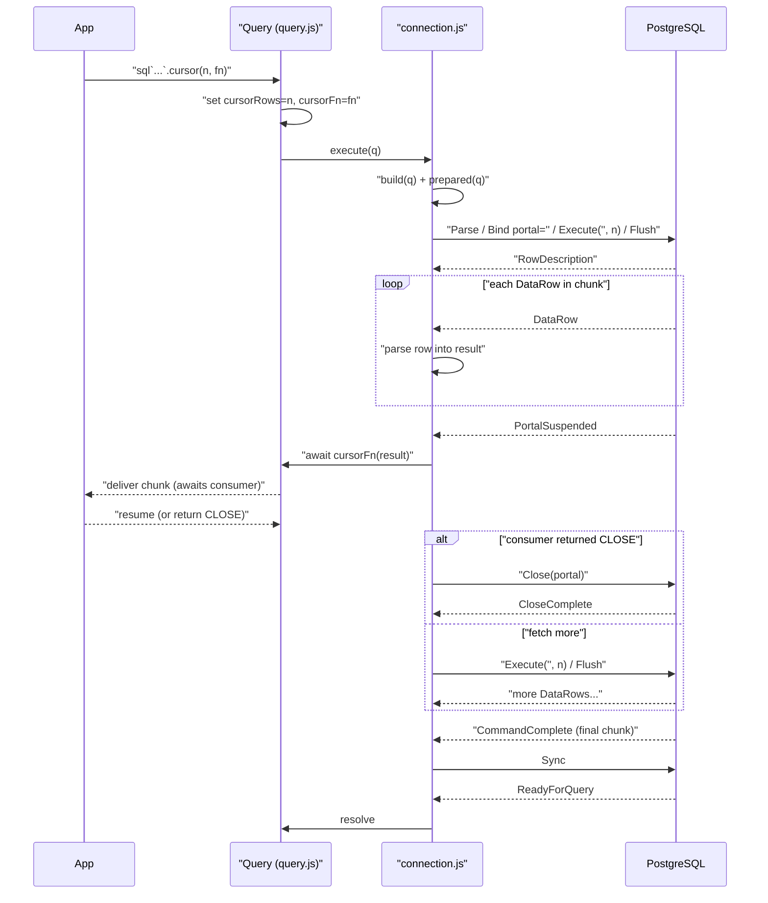

### node-postgres

`pg-cursor` (`packages/pg-cursor/index.js`) is a `Submittable` EventEmitter. The pg `Client` dequeues it and calls `cursor.submit(connection)` (`pg/lib/client.js:603-611`), then routes protocol callbacks (`handleRowDescription`, `handleDataRow`, `handlePortalSuspended`, `handleCommandComplete`, `handleReadyForQuery`, `handleError`) to it (`client.js:437-488`). `submit()` allocates a **named portal** `C_<id>` (`pg-cursor/index.js:46`) and sends `Parse` / `Bind(portal)` / `Describe('P', portal)` / `Flush` (`index.js:50-73`) — note no `Execute` yet, so nothing is fetched until the consumer asks.

`read(rows, cb)` (`index.js:234-257`) is the fetch primitive: in `idle`/`submitted` state it calls `_getRows`, which sends `Execute(portal, rows)` + `Flush` and sets state `busy` (`index.js:189-199`); concurrent reads while `busy`/`initialized` are pushed onto `_queue`. `handleDataRow` accumulates into `_rows` and emits `'row'` (`index.js:113-117`). `handlePortalSuspended` calls `_sendRows`, which `setImmediate`-defers the user callback with the batch and resets to `idle` (`index.js:119-142`). When the chunk is the last one the server sends `CommandComplete` → `handleCommandComplete` → `_closePortal`, which sends `Close(portal)` + `Sync` (needed because the portal is named; leaving it open can lock tables inside a transaction — `index.js:89-105`); `handleReadyForQuery` then flushes remaining rows and emits `'end'`.

`pg-query-stream` (`packages/pg-query-stream/src/index.ts`) is a `Readable` in `objectMode` wrapping a `Cursor`, with `highWaterMark = batchSize || 100` (`index.ts:25-28`). It delegates every protocol handler to the cursor (`index.ts:39-45`). Node's stream machinery calls `_read(size)` only when the internal buffer drops below the high-water mark — that is the backpressure mechanism: `_read` calls `cursor.read(size, cb)`, pushes each row, and calls `this.push(null)` when `rows.length < size` (short read = exhausted) (`index.ts:62-72`). `_destroy` calls `cursor.close` to clean up the portal (`index.ts:55-59`).

```mermaid
sequenceDiagram
    participant Node as "Readable (pg-query-stream)"
    participant Cur as "Cursor (pg-cursor)"
    participant Client as "Client (client.js)"
    participant PG as PostgreSQL
    Node->>Client: "query(stream) -> submit(connection)"
    Cur->>PG: "Parse / Bind portal=C_id / Describe(P) / Flush"
    PG-->>Cur: "RowDescription (handleRowDescription -> idle)"
    Node->>Cur: "_read(size) -> read(size, cb)"
    Cur->>PG: "Execute(C_id, size) / Flush"
    loop "DataRow per row"
        PG-->>Cur: "DataRow (push to _rows)"
    end
    alt "chunk full"
        PG-->>Cur: "PortalSuspended -> _sendRows"
        Cur-->>Node: "cb(rows); push rows; await next _read"
    else "result exhausted"
        PG-->>Cur: "CommandComplete -> _closePortal"
        Cur->>PG: "Close(C_id) / Sync"
        PG-->>Cur: "ReadyForQuery -> _sendRows + emit end"
        Cur-->>Node: "rows.length < size -> push(null)"
    end
```

### Comparison & design takeaways for a new driver

- **Portal naming.** node-postgres uses a *named* portal (`C_<id>`) and therefore **must** explicitly `Close` it + `Sync`, or it can lock tables in a transaction (`pg-cursor/index.js:92-105`). postgres.js uses the *unnamed* portal `''` and only `Close`s on early termination, relying on the implicit close at next `Bind`/transaction-end. The unnamed portal is simpler and one fewer round-trip on the happy path; a new driver should prefer it unless it needs concurrent portals on one connection.
- **Backpressure model.** node-postgres bolts cursor onto Node's `Readable` and lets `_read`/highWaterMark gate fetches — idiomatic and composable with `pipe`. postgres.js gets equivalent backpressure for `.cursor` by `await`ing `cursorFn` inside `PortalSuspended` and, for the iterator form, by parking the fetch loop on a consumer-controlled promise (`query.js:93-104`, `connection.js:841`). Both are valid; the promise-handshake is leaner (no stream object) but less interoperable with the Node stream ecosystem. A new driver should expose *both* an async-iterator and a `Readable` adapter over one core fetch primitive.
- **`.forEach` is not a real cursor.** postgres.js `.forEach` streams via `forEachFn` per `DataRow` (`connection.js:521-523`) but uses `ExecuteUnnamed` (row limit 0), so the *server* sends the whole result and there is no portal-level flow control — backpressure exists only at TCP. Footgun: it looks like streaming but the server can outrun a slow consumer. Document the distinction (`.forEach` = low memory on the client, `.cursor(n)` = bounded server-side fetch) and make the bounded path the default for "stream a huge table."
- **State machine vs implicit.** pg-cursor's explicit `state` field (`initialized/submitted/idle/busy/done/error`) plus a `_queue` cleanly serializes overlapping `read()` calls and error fan-out (`index.js:243-257, 154-187`). postgres.js folds this into the connection's single `query`/`sent` pipeline. The explicit state machine is easier to reason about for reads issued out of order; adopt a similar guard.
- **`setImmediate` deferral.** pg-cursor defers callbacks via `setImmediate` so a new `read()` can register before the previous callback fires (`index.js:121-133`) — subtle but load-bearing; a naive synchronous callback would drop the re-entrant read. Worth replicating or avoiding by using promises end-to-end.
- **COPY / large objects.** Both stream `COPY` over `CopyData` with socket-level pause (`connection.js:906-908`); large objects in postgres.js are just `lo_*` SQL calls wrapped in Node streams inside a transaction (`large.js`). These are orthogonal to portal cursors — a new driver should keep them as separate, clearly-named APIs rather than overloading the cursor path.

### Verification notes
Verified against source: all file:line citations are real and accurate (query.js:74/123/88-104/62-72; connection.js:207-214/224-244/521-523/839-850/608-614/852-855/906-908/982-987; large.js:36-67; pg-cursor/index.js:46/50-73/189-199/234-257/113-117/119-142/89-105/144-148; pg-query-stream src/index.ts:25-28/39-45/55-59/62-72; pg/lib/client.js:603-611/437-488). Both Mermaid diagrams render (valid syntax; quoted aliases/labels and embedded backticks are legal). The node-postgres diagram is faithful end-to-end. Core claims (unnamed portal `''` for postgres.js vs named `C_<id>` for node-postgres, ExecuteUnnamed = row-count 0 for `.forEach`, Execute+Flush vs Execute+Sync, promise-handshake backpressure, setImmediate deferral) are all correct.

Minor (non-blocking) observations, no edits made:
- postgres.js `Close()` helper (connection.js:989-993) bundles a `Sync` after the Close message (`b().C()...` then `b().S()`). The prose and first diagram show only "Close(portal)" on the CLOSE-sentinel path; the implicit trailing Sync (and the resulting ReadyForQuery) is unstated but happens.
- First diagram tail (CommandComplete -> Sync -> ReadyForQuery -> resolve) is drawn unconditionally after the alt/else, but the CLOSE branch actually terminates via Close->CloseComplete->resolve (connection.js:843-844, 852-855) with no CommandComplete. Reasonable simplification, but the tail strictly applies only to the "fetch more / finish" path.
- Intro sentence "the portal is closed and Sync flips the connection back to ReadyForQuery": on the postgres.js happy path no explicit Close is sent on CommandComplete — only `write(Sync)` (connection.js:613); the unnamed portal closes implicitly. The explicit Close+Sync is the node-postgres behavior. Loose generalization across both drivers.
- First diagram omits BindComplete before the DataRow loop, and `q.cursorFn` gate also affects the `result.count && query.cursorFn(result)` guard in CommandComplete (cursorFn only invoked when count is set). Cosmetic.

Verdict: diagrams faithful to source, valid Mermaid, citations accurate. Only minor stylistic/omission notes above.


## COPY IN / COPY OUT

Both drivers speak the same wire protocol for bulk transfer: the backend replies to a `COPY ... FROM STDIN` / `COPY ... TO STDOUT` query with `CopyInResponse` (`G`) or `CopyOutResponse` (`H`); the client then pushes `CopyData` (`d`) frames and finishes with `CopyDone` (`c`) or aborts with `CopyFail` (`f`). The divergence is in the *API surface*: postgres.js builds the whole COPY-streaming feature **in-repo** by handing the user a native Node `stream` whose `_write`/`_read`/`_final` map directly onto socket writes (`connection.js:857-913`). node-postgres core ships only **stubs** — `pg/lib/query.js:247-253` aborts any COPY with `sendCopyFail('No source stream defined')` — and real COPY streaming lives in the **external** `pg-copy-streams` package (not present in this repo), except for the native libpq path which has its own in-repo `pg-native/lib/copy-stream.js`.

### postgres.js

COPY is opted into per-query: `query.writable()` / `query.readable()` (`query.js:62-72`) just set `this.streaming = true` and force `.simple()` mode, then resolve the query's promise with a Node stream object rather than a `Result`. The query is sent as a normal simple query (`toBuffer` -> `b().Q()...`, `connection.js:190`); the stream is created lazily inside the message handlers when the backend confirms COPY:

- `CopyInResponse` (`G`, `connection.js:857-875`) builds a `Stream.Writable`. Its `write(chunk,...)` wraps the chunk as a `CopyData` frame `b().d().raw(chunk).end()` and writes straight to the socket; `final(callback)` sends `CopyDone` `b().c().end()` and stashes the stream-end callback in `final` (resolved later by `CommandComplete`, `connection.js:603`); `destroy(error,...)` sends `CopyFail` `b().f().str(error + b.N).end()`. The Writable is handed to the user via `query.resolve(stream)` (`:874`).
- `CopyOutResponse` (`H`, `connection.js:877-882`) builds a `Stream.Readable` whose `read()` calls `socket.resume()`.
- `CopyData` (`d`, `connection.js:906-908`) pushes the payload (sliced past the 5-byte header) into the stream; if `stream.push()` returns false (backpressure) it calls `socket.pause()`.
- `CopyDone` (`c`, `connection.js:910-913`) pushes `null` (EOF) and clears `stream`.
- `CopyBothResponse` (`W`, `connection.js:885-904`) builds a `Stream.Duplex` for logical replication, combining the read and write halves above.

While a COPY stream is live, `stream` is non-null and `execute()` rejects any other query with `COPY_IN_PROGRESS` (`connection.js:160-161`), serializing the connection. Errors propagate via `errored()` which destroys the stream (`connection.js:391`). Note the message builders `d`/`c`/`f` come from `bytes.js`.

```mermaid
sequenceDiagram
    participant U as User code
    participant Q as Query.writable/readable
    participant C as Connection handlers
    participant PG as PostgreSQL
    U->>Q: sql`COPY t FROM STDIN`.writable
    Q->>Q: simple, streaming = true
    Q->>C: execute -> b.Q simple query
    C->>PG: Query "COPY ... FROM STDIN"
    PG-->>C: CopyInResponse G
    C->>C: build Stream.Writable, query.resolve stream
    C-->>U: resolves promise with Writable
    loop each chunk written
        U->>C: stream.write chunk
        C->>PG: CopyData d + raw chunk
    end
    U->>C: stream.end
    C->>PG: CopyDone c
    PG-->>C: CommandComplete C
    C->>C: final callback fires, stream = null
    PG-->>C: ReadyForQuery Z
    Note over U,PG: COPY OUT mirror: CopyOutResponse H builds Readable;<br/>CopyData d pushes chunks with socket.pause backpressure;<br/>CopyDone c pushes null EOF
```

### node-postgres

Core `pg` has only the plumbing, not a usable COPY stream. The parser decodes the messages: `parseCopyInMessage` / `parseCopyOutMessage` build a `CopyResponse` carrying `binary` flag and `columnTypes` (`pg-protocol/src/parser.ts:258-270`, `messages.ts:131-141`), and `parseCopyData` slices the chunk into a `CopyDataMessage` (`parser.ts:253-256`, `messages.ts:123-129`). `Client` listens for `copyInResponse` and `copyData` and forwards them to the active query (`pg/lib/client.js:264-265, 506-524`). But the default `Query.handleCopyInResponse` immediately sends `CopyFail` and `handleCopyData` is a no-op (`pg/lib/query.js:247-253`). The outbound side exists as thin `Connection` methods that call the serializer: `sendCopyFromChunk` -> `serialize.copyData` (`d`, `0x64`), `endCopyFrom` -> `serialize.copyDone` (`c`), `sendCopyFail` -> `serialize.copyFail` (`f`) (`pg/lib/connection.js:229-239`; `pg-protocol/src/serializer.ts:244-257`).

To actually stream, users install the **external `pg-copy-streams`** package (not in this repo). It supplies a custom *submittable* (a query-like object with its own `submit`, `handleCopyInResponse`, `handleCopyData`, `handleCommandComplete`) that the client runs via `client.query(copyStream)`, overriding the stub handlers to wire `connection.sendCopyFromChunk` / `endCopyFrom` for COPY-IN and to push `CopyDataMessage.chunk` into a Readable for COPY-OUT.

The **native** binding has an in-repo Duplex, `pg-native/lib/copy-stream.js`, built on libpq rather than the JS protocol parser: `_write` calls `pq.putCopyData(chunk)` (return `1` ok, `-1` error, else block and retry on `pq.writable()`), `end()` calls `pq.putCopyEnd()` then `consumeResults()`, and the read side `_consumeBuffer` calls `pq.getCopyData(true)` returning a `Buffer`, `-1` (EOF -> push null) or `0` (wait for `readable`). This bypasses the `CopyData`/`CopyDone` wire framing entirely since libpq handles it.

```mermaid
sequenceDiagram
    participant U as User code
    participant CS as pg-copy-streams (external)
    participant CL as Client
    participant CN as Connection
    participant P as Parser
    participant PG as PostgreSQL
    U->>CL: client.query(copyFrom(...))
    CL->>CN: query "COPY ... FROM STDIN"
    CN->>PG: Query
    PG-->>P: CopyInResponse G
    P->>CL: copyInResponse event
    CL->>CS: activeQuery.handleCopyInResponse(connection)
    Note over CS: external pkg overrides the stub;<br/>core stub would sendCopyFail
    loop each chunk
        U->>CS: stream.write chunk
        CS->>CN: sendCopyFromChunk -> serialize.copyData d
        CN->>PG: CopyData
    end
    U->>CS: stream.end
    CS->>CN: endCopyFrom -> serialize.copyDone c
    CN->>PG: CopyDone
    PG-->>P: CommandComplete then ReadyForQuery
    Note over U,PG: COPY OUT: parser emits CopyDataMessage per d frame;<br/>external pkg pushes chunk into Readable, copyDone ends it.<br/>Native path (pg-native/lib/copy-stream.js) uses libpq<br/>putCopyData/putCopyEnd/getCopyData instead of wire framing
```

### Comparison & design takeaways for a new driver

- **In-repo vs external is the headline difference.** postgres.js treats COPY as a first-class, batteries-included feature (`.writable()`/`.readable()`/replication Duplex all in `connection.js`). node-postgres core deliberately ships only stubs (`query.js:247-253` literally aborts) and offloads the real stream to the third-party `pg-copy-streams`, plus a separate libpq Duplex for native. A new driver should decide early: shipping COPY in-core (like postgres.js) gives a far better out-of-box UX and avoids version-skew between the driver and an external streaming package.
- **Backpressure is handled, but crudely, in postgres.js.** COPY-OUT pauses/resumes the *entire socket* (`socket.pause()` on `stream.push()===false`, `connection.js:907`; `socket.resume()` in `read()`/`CopyOutResponse`). That works because the connection is single-query-at-a-time, but it couples one stream's consumer speed to the raw TCP socket. A new driver should keep per-stream backpressure but be conscious this blocks the whole connection.
- **COPY monopolizes the connection in both.** postgres.js guards with `COPY_IN_PROGRESS` (`connection.js:160`); node-postgres effectively does the same via the active-query model. This is inherent to the protocol (COPY is a sub-protocol with no pipelining). A new driver must enforce this explicitly and surface a clear error, not hang.
- **Outbound framing is trivial and identical** — `CopyData` = code `d` + raw bytes, `CopyDone` = code `c`, `CopyFail` = code `f` + cstring. postgres.js builds these inline with its `bytes.js` builder; node-postgres centralizes them in `serializer.ts:244-257`. The centralized, named serializer functions are cleaner and more testable than inline byte juggling — adopt that.
- **Footgun in postgres.js `CopyFail`:** `destroy(error,...)` interpolates `error + b.N` (`connection.js:865`) — if `error` is an Error object this stringifies to `"Error: ..."`, and it calls `callback(error)` *before* writing CopyFail, an unusual ordering. A new driver should send `CopyFail` with a clean message string and follow Node's `destroy` contract (write first, then callback).
- **Native path shows a cleaner state machine** (`pg-native/lib/copy-stream.js`): explicit return-code handling (`1`/`-1`/`0`/block-and-retry via `pq.writable()`/`pq.once('readable')`). For a pure-JS driver you can't reuse libpq, but the explicit "would-block, register one-shot, retry" pattern is a good model for async write backpressure rather than postgres.js's socket-wide pause.
- **Binary COPY metadata is parsed but unused for routing in node-postgres** (`CopyResponse.binary` / `columnTypes`, `messages.ts:131-141`); postgres.js ignores the header entirely and just streams raw bytes. A new driver that wants binary COPY support should expose the `binary` flag and column type OIDs from the `CopyInResponse`/`CopyOutResponse` header to the stream consumer.

### Verification notes
Verified: diagrams faithful to source, valid Mermaid.

Spot-checked every citation against the real source; all are accurate:
- postgres.js `connection.js`: CopyInResponse 857-875 (Writable; write -> `b().d().raw(chunk)`, final -> `b().c()` stashes `final`, destroy -> `b().f().str(error + b.N)`), CopyOutResponse 877-882 (Readable, read -> `socket.resume()`), CopyData 906-908 (`stream.push(x.subarray(5)) || socket.pause()`), CopyDone 910-913 (push null), CopyBothResponse 885-904 (Duplex), COPY_IN_PROGRESS guard 160-161, `errored` destroys stream 391, `final()` fired in CommandComplete 603, simple `b().Q()` 190. The footgun (callback(error) at :864 *before* CopyFail write at :865) is real.
- query.js readable/writable 62-72 set simple()+streaming. bytes.js d/c/f builders come from the `'BCcDdEFfHPpQSX'` reduce (line 4) + `raw` (49).
- node-postgres: query.js stub handlers 247-253 (sendCopyFail / noop) confirmed; connection.js sendCopyFromChunk/endCopyFrom/sendCopyFail 229-239; client.js listeners 264-265 and _handleCopyInResponse/_handleCopyData 506-524; parser.ts parseCopyData 253-256, parseCopyInMessage/parseCopyOutMessage/parseCopyMessage 258-270; messages.ts CopyDataMessage 123-129, CopyResponse (binary, columnTypes) 131-141; serializer.ts copyData/copyFail 244-249 + copyDoneBuffer 257, codes copyFromChunk=0x64 'd', copyDone=0x63 'c', copyFail=0x66 'f'.
- pg-native/lib/copy-stream.js confirmed: `_write` -> putCopyData (1 ok / -1 error / block-retry via pq.writable), `end` -> putCopyEnd then consumeResults, `_consumeBuffer` -> getCopyData(true) returning Buffer / -1 EOF / 0 wait-readable.

Both Mermaid sequence diagrams render cleanly (message-text `+` and `->` appear only after the `:` label, not as activation/arrow tokens, so no parse error).

Nit (not corrected, not material): the prose says `.readable()/.writable()` "resolve the query's promise with a Node stream object" — those methods themselves only set `simple()` + `streaming` and return `this`; the actual `query.resolve(stream)` happens in the CopyIn/CopyOutResponse handlers, which the very next sentence states correctly.


## LISTEN/NOTIFY & Logical Replication

Both drivers decode the async `NotificationResponse` ('A', byte `0x41`) message that Postgres can push at any time on a long-lived connection, independently of the request/response query flow. postgres.js builds a full, opinionated layer on top: a dedicated single connection for `LISTEN` with automatic channel re-registration on reconnect (`index.js:147`), plus a logical-replication/CDC subscriber that opens a temporary replication slot and parses the `pgoutput` stream (`subscribe.js`). node-postgres stops at the protocol edge — it parses the message in `pg-protocol` and re-emits a `'notification'` event on the `Client` (`client.js:526`); channel registration, re-LISTEN after reconnect, and any replication API are left entirely to the application or community packages. Notably node-postgres's `pg-protocol` parser already understands `ReplicationStart` ('W', `0x57`) and `CopyData` ('d', `0x64`) (`parser.ts:70,75`), but the core `Client` only routes `copyData` to the active query, with no high-level replication helper.

### postgres.js

LISTEN/NOTIFY (`src/index.js`):
- `listen(name, fn, onlisten)` (`index.js:147`) lazily creates a *separate* dedicated connection pool `listen.sql` with `max: 1, idle_timeout: null, max_lifetime: null` (`index.js:150-165`) so the listener socket is never recycled or shared with normal queries.
- Channels are tracked in `listen.channels[name] = { result, listeners: [] }` (`index.js:167-179`). A second listener on an existing channel just pushes into `listeners` and awaits the already-issued `LISTEN` (`index.js:170-175`); the first listener issues `sql`listen "name"`` with the name double-quote-escaped (`index.js:177-179`).
- Incoming notifications arrive via the connection's `onnotify(c, x)` callback (`index.js:162-164`), which fans the payload out to every `listener.fn` registered for channel `c`.
- Reconnect re-registration: the dedicated `sql`'s `onclose()` hook (`index.js:156-161`) wipes `listen.channels` and re-invokes `listen(...)` for every previously-registered listener, re-issuing the `LISTEN` commands on the new socket.
- `unlisten()` (`index.js:184-196`) removes the listener; only when a channel's `listeners` array is empty does it actually send `UNLISTEN "name"`.
- `notify(channel, payload)` (`index.js:199-201`) is just `select pg_notify($1, $2)` on the normal pool.

Protocol decode (`src/connection.js`): the message dispatcher maps `x === 65` ('A') to `NotificationResponse` (`connection.js:465`). `NotificationResponse(x)` (`connection.js:827-837`) skips the 4-byte PID at offset 9, scans for the NUL terminating the channel name, then slices channel and payload strings and calls `onnotify(channel, payload)`.

Logical replication / CDC (`src/subscribe.js`):
- `Subscribe(postgres, options)` (`subscribe.js:3`) builds a dedicated `sql` with `max: 1`, `fetch_types: false`, and crucially `connection: { replication: 'database' }` (`subscribe.js:12-32`), which sends `replication=database` in the startup packet so the backend enters walsender mode.
- `init()` (`subscribe.js:80-104`) runs `CREATE_REPLICATION_SLOT <slot> TEMPORARY LOGICAL pgoutput NOEXPORT_SNAPSHOT` via `sql.unsafe`, then `START_REPLICATION SLOT <slot> LOGICAL <consistent_point> (proto_version '1', publication_names '<pubs>')` and calls `.writable()` (`query.js:68-72`) to get back a stream.
- `START_REPLICATION` makes the backend reply `CopyBothResponse` ('W', `connection.js:486` → `CopyBothResponse()` at `connection.js:885-904`), which resolves the query with a `Stream.Duplex`. Subsequent WAL data arrives as `CopyData` ('d') frames pushed into that duplex (`connection.js:906-908`).
- `data(x)` (`subscribe.js:110-117`) inspects the first byte of each WAL message: `0x77` ('w', XLogData) → `parse(x.subarray(25), ...)` decodes the embedded `pgoutput` message; `0x6b` ('k', Primary keepalive) with reply-requested flag set updates `state.lsn` and calls `pong()`.
- `pong()` (`subscribe.js:129-135`) writes a Standby Status Update ('r') with the current LSN and a Postgres-epoch timestamp back through the duplex's writable side (which serializes to `CopyData`).
- `parse()` (`subscribe.js:147-232`) decodes `pgoutput` tags: `R` (Relation, caches column metadata + replica-identity keys), `B`/`C` (Begin/Commit), `I`/`U`/`D` (Insert/Update/Delete → `tuples()` builds the row and calls `handle`). `handle()` (`subscribe.js:119-127`) emits to subscriber patterns like `*`, `*:schema.table`, `insert:schema.table`, and key-filtered `...=key`.
- Reconnect: the dedicated `sql`'s `onclose` (`subscribe.js:23-30`) re-runs `init()` (new slot, fresh `START_REPLICATION`) and replays every subscriber's `onsubscribe()`. Because the slot is `TEMPORARY`, it vanishes on disconnect and is recreated — meaning replay starts at the new `consistent_point`, not the last confirmed LSN.

```mermaid
sequenceDiagram
    participant App
    participant Listen as "listen() index.js:147"
    participant LSQL as "dedicated sql max:1"
    participant Conn as "connection.js"
    participant PG as Postgres

    Note over App,PG: LISTEN / NOTIFY
    App->>Listen: "listen('chan', fn)"
    Listen->>LSQL: "first time: create pool idle_timeout:null"
    Listen->>Conn: "sql`listen \"chan\"`"
    Conn->>PG: "LISTEN chan"
    PG-->>Conn: "CommandComplete + ReadyForQuery"
    Conn-->>Listen: "resolve channels[chan].result"
    Listen-->>App: "{ state, unlisten }"
    PG-->>Conn: "NotificationResponse 'A' 0x41"
    Conn->>Conn: "NotificationResponse() parse pid/chan/payload"
    Conn->>Listen: "onnotify(chan, payload)"
    Listen->>App: "fn(payload)"

    Note over App,PG: Reconnect re-registration
    Conn-->>LSQL: "socket closed -> onclose()"
    LSQL->>Listen: "replay listen() for each channel"
    Listen->>PG: "LISTEN chan (new socket)"

    Note over App,PG: Logical replication subscribe.js
    App->>LSQL: "subscribe('insert:public.t', fn)"
    LSQL->>PG: "startup replication=database"
    LSQL->>PG: "CREATE_REPLICATION_SLOT slot TEMPORARY LOGICAL pgoutput"
    PG-->>LSQL: "consistent_point LSN"
    LSQL->>PG: "START_REPLICATION SLOT ... (proto_version '1', publication_names)"
    PG-->>Conn: "CopyBothResponse 'W'"
    Conn-->>LSQL: "resolve Duplex stream"
    loop WAL stream
        PG-->>Conn: "CopyData 'd'"
        Conn->>LSQL: "stream.push(payload)"
        LSQL->>LSQL: "data(): 0x77 -> parse pgoutput / 0x6b -> pong()"
        LSQL->>PG: "Standby Status 'r' (CopyData) LSN ack"
        LSQL->>App: "fn(row, meta)"
    end
```

### node-postgres

There is no LISTEN abstraction and no replication API in core `pg` — it surfaces the raw protocol events only:
- `Connection.attachListeners` (`connection.js:130-138`) pipes every parsed message into `this.emit(eventName, msg)`; for a `NotificationResponseMessage` the name is `'notification'`.
- `Client._attachListeners` wires `con.on('notification', this._handleNotification.bind(this))` (`client.js:266`), and `_handleNotification(msg)` simply re-emits on the client: `this.emit('notification', msg)` (`client.js:526-528`). `msg` carries `{ processId, channel, payload }` (`messages.ts:203-211`).
- To actually receive notifications the application must run `client.query('LISTEN chan')` itself and subscribe via `client.on('notification', ...)`. The driver does not track channels, so after a socket error there is no automatic re-LISTEN — and because a `Client` is single-use (`client.js:153-159`, "You cannot reuse a client"), reconnection means constructing a new `Client` and re-issuing every `LISTEN` manually (or using `pg-pool`, though pooled clients are unsuitable for persistent LISTEN since they get returned/recycled).
- Notifications are decoded by `parseNotificationMessage` (`parser.ts:272-276`): reads PID, then the NUL-terminated channel and payload C-strings.
- Replication: `pg-protocol` recognizes `ReplicationStart` ('W', `parser.ts:70,184-185`) and `CopyData` ('d', `parser.ts:75,229-230`), and `Connection` exposes `sendCopyFromChunk/endCopyFrom/sendCopyFail` (`connection.js:229-238`). But core `Client._handleCopyData` (`client.js:516-524`) only forwards `copyData` to the *active query*; there is no logical-decoding parser, no standby-status keepalive, no slot management. Logical replication is delegated to community packages (e.g. `pg-logical-replication`) that drive the `Client`/`Connection` directly. Replication mode itself is opt-in via the `replication` startup parameter (`client.js:546-548`).

```mermaid
sequenceDiagram
    participant App
    participant Client as "Client client.js"
    participant Conn as "Connection connection.js"
    participant Parser as "pg-protocol parser.ts"
    participant PG as Postgres

    Note over App,PG: Manual LISTEN, no built-in registry
    App->>Client: "client.query('LISTEN chan')"
    Client->>PG: "LISTEN chan (normal query queue)"
    PG-->>Conn: "CommandComplete + ReadyForQuery"
    App->>Client: "client.on('notification', cb)"

    Note over App,PG: Async notification delivery
    PG-->>Conn: "NotificationResponse 'A' 0x41"
    Conn->>Parser: "parseNotificationMessage"
    Parser-->>Conn: "{processId, channel, payload}"
    Conn->>Client: "emit('notification', msg)"
    Client->>Client: "_handleNotification client.js:526"
    Client->>App: "emit('notification', msg) -> cb"

    Note over App,PG: Socket dies
    Conn-->>Client: "con 'end' -> _errorAllQueries, _ended"
    Client--xApp: "Client single-use: app must build new Client and re-LISTEN"

    Note over App,PG: Replication = community-package territory
    App->>Client: "query START_REPLICATION (replication=database startup)"
    PG-->>Conn: "ReplicationStart 'W' / CopyData 'd' parsed"
    Conn->>Client: "emit('copyData') -> _handleCopyData"
    Client->>App: "activeQuery.handleCopyData (no decode)"
```

### Comparison & design takeaways for a new driver

- Channel registry & reconnect: postgres.js owns a channel→listeners map and *automatically re-issues every `LISTEN` after a reconnect* via `onclose` (`index.js:156-161`); node-postgres has zero state — a dropped socket silently stops notifications and (since `Client` is single-use) forces the app to rebuild the connection and re-`LISTEN`. The new driver should adopt postgres.js's automatic re-registration.
- Dedicated connection: postgres.js isolates LISTEN onto a `max:1, idle_timeout:null, max_lifetime:null` connection (`index.js:150-155`) so the long-lived socket is never recycled. node-postgres gives no guard rails — using a *pooled* client for LISTEN is a footgun because the client can be returned and reused. A new driver should make the "persistent listener connection" a first-class, non-recyclable concept.
- Notification fan-out: postgres.js de-duplicates `LISTEN` per channel and supports multiple `fn` per channel with ref-counted `UNLISTEN` (`index.js:170-196`); node-postgres emits one global `'notification'` event, leaving channel routing to the app. The ref-counted, per-channel model is cleaner and worth adopting.
- Replication: postgres.js ships a usable logical-replication/CDC client (slot creation, `pgoutput` decode, standby keepalive `pong`) (`subscribe.js`); node-postgres only parses `ReplicationStart`/`CopyData` and defers everything else to community code. A new driver targeting CDC should bake in the walsender state machine.
- Footgun in postgres.js's replication: the slot is `TEMPORARY ... NOEXPORT_SNAPSHOT` and on reconnect `init()` *recreates a fresh slot* (`subscribe.js:23-30,80-104`), so the resume point is the new `consistent_point`, not the last acked LSN — events produced during the outage can be lost, and there is no durable cursor. The error handler also just logs and relies on the close/reconnect path (`subscribe.js:106-108`). A new driver should support *persistent* slots and resume from a stored, confirmed LSN.
- Keepalive correctness: postgres.js sends Standby Status Updates only in response to keepalive requests with the reply bit set (`subscribe.js:113-116`), without a periodic timer; a robust driver should also send periodic status updates to avoid `wal_sender_timeout` disconnects under low traffic.
- Parsing hygiene: both walk NUL-terminated C-strings for the notification channel/payload (`connection.js:827-837` vs `parser.ts:272-276`) — equivalent and low-risk; the new driver can follow either. postgres.js's hand-rolled inline `pgoutput` parser using charcode dispatch (`subscribe.js:147-231`) is terse but hard to extend to newer `proto_version` values (it pins `proto_version '1'`); a new driver should structure protocol versions explicitly.

### Verification notes
Verified against real source — diagrams faithful to control/message flow, valid Mermaid (both render; quoted participant aliases with embedded `file:line` colons and `--x`/self-message arrows are all legal).

All file:line citations confirmed accurate:
- postgres.js `index.js`: `listen` 147, dedicated pool config + `onclose`/`onnotify` 150-165, channel tracking 167-179, `onnotify` 162-164, `onclose` 156-161, `unlisten` 184-196, `notify` 199-201.
- postgres.js `connection.js`: dispatch `x===65 → NotificationResponse` 465, `x===87 → CopyBothResponse` 486, `NotificationResponse()` 827-837, `CopyBothResponse()` 885-904, `CopyData` 906-908.
- postgres.js `subscribe.js`: `Subscribe`/dedicated sql `replication:'database'` 3/12-32, `init` 80-104, `data` 110-117 (`0x77`→parse, `0x6b`&&`x[17]`→pong), `pong` 129-135 (`'r'`), `parse` 147-232, `handle` 119-127, `onclose` 23-30, error handler 106-108, `proto_version '1'` pinned at line 93. `.writable()` at `query.js` 68-72 confirmed.
- node-postgres: `Connection.attachListeners` 130-138, `sendCopyFromChunk/endCopyFrom/sendCopyFail` 229-238; `Client` notification wiring `client.js:266`, `_handleNotification` 526-528, `_handleCopyData` 516-524, single-use guard 153-159, `con.once('end')→_errorAllQueries/_ended` 198-224, replication startup 546-548; `pg-protocol` `ReplicationStart=0x57`/`CopyData=0x64` at parser.ts 70/75, cases 184-185 / 229-230, `parseNotificationMessage` 272-276, `NotificationResponseMessage{processId,channel,payload}` messages.ts 203-211. All confirmed.

Minor, non-blocking nits (not corrected):
1. `connection.js:827-837` prose says "skips the 4-byte PID at offset 9" — the PID actually occupies offsets 5-8; offset 9 is where the channel name *begins*. The described behavior (start scan at index 9, past type+length+PID) is correct; only the "at offset 9" phrasing is loose.
2. In the first Mermaid diagram the `LSQL` participant ("dedicated sql max:1") is reused for both the LISTEN dedicated pool (`listen.sql`) and the logical-replication subscriber pool (`subscribe.sql`). These are two distinct connections/pools in the source; sharing one box is a harmless abstraction but slightly conflates them.
3. Listen dedicated-pool config also sets `fetch_types: false` (index.js:155), omitted from the prose list at line 8 — immaterial.


## Errors, Teardown, Reconnect & Pipelining

Both drivers guarantee that every in-flight query settles on any terminal event — a backend `ErrorResponse`, a socket `error`, or a socket `close` — but they reach the invariant from opposite designs. postgres.js runs a **single socket that pipelines many queries** (`sent` queue, up to `max_pipeline`, default 100), defers `ErrorResponse` settlement until the next `ReadyForQuery` sync boundary, and **auto-reconnects the same `Connection` object with exponential backoff**. node-postgres runs **strictly one active query per `Client`** (a `_queryQueue` that is drained serially), settles errors immediately on the `errorMessage` event, and **never reconnects a `Client`** — reconnection is the `Pool`'s job, which discards the dead client and lazily builds a fresh one. The shared anchor is the same: every settlement path funnels through one rejection function (`queryError`/`query.reject` in postgres.js, `query.handleError`/`_errorAllQueries` in pg).

### postgres.js

**Pipelining.** `execute(q)` (connection.js:156) makes `q` the active `query` if none is active, otherwise pushes it onto the `sent` queue (connection.js:169). It writes the query bytes immediately and returns `true` only while `sent.length < max_pipeline` (connection.js:176), which is the backpressure signal the pool uses to move a connection to the `full` queue. Many queries are thus on the wire concurrently, each terminated by its own `Sync`; responses are demultiplexed in FIFO order by `ReadyForQuery` shifting `sent` (connection.js:573).

**ErrorResponse is deferred, not immediate.** `ErrorResponse(x)` (connection.js:812) does NOT reject. With an active `query` it stashes `errorResponse = Errors.postgres(parseError(x))` and, for cursor/`describeFirst` queries, writes a `Sync` to force the backend back to a ready state. Settlement happens at `ReadyForQuery` (connection.js:535): if `errorResponse` is set it either retries (see below) or calls `errored(errorResponse)`; otherwise `query.resolve(results || result)`. Accumulated `DataRow`s in `result` are simply dropped when an error supersedes them — partial results never leak to the caller.

**Automatic prepared-statement retry.** At RFQ, if the failed query was `prepared` and `errorResponse.routine` is one of `FetchPreparedStatement`, `RevalidateCachedQuery`, `transformAssignedExpr` (connection.js:25-29), `retry(query, errorResponse)` (connection.js:821) deletes the stale cached statement, marks `q.retried`, and re-executes. A second failure (`query.retried` already set) is final: `errored(query.retried)`.

**Socket error / close.** `error(err)` (connection.js:381) skips settlement while still connecting if another host is available (multi-host failover), else `errored(err)` rejects the active query and drains `sent` via `queryError`. `closed(hadError)` (connection.js:436) is the socket `close` handler: if `initial` is still pending it just `reconnect()`s; otherwise it rejects in-flight work with `CONNECTION_CLOSED`, records `closedTime`, bumps `options.shared.retries` on `hadError`, computes `delay` from `backoff(retries)` (index.js:511, exponential with jitter, capped at 20s), and calls `onclose`. `reconnect()` (connection.js:361) is a `setTimeout(connect, ...)` honoring that backoff delay.

**Settlement guarantee.** Every rejection routes through `queryError` (connection.js:396), which attaches `query`/`parameters`/`origin` to the error and calls `query.reject`; `query.reject`/`query.resolve` (query.js:26-27) flip `active = false`. `terminate()` (connection.js:422) sends `X` and rejects everything still in flight with `CONNECTION_DESTROYED`. Pool-level orchestration lives in index.js `onclose` (index.js:421): the connection is moved to the `closed` queue and immediately reconnected if queries are still waiting.

```mermaid
flowchart TD
  EXEC["execute q, connection.js:156"] --> ACT{"active query?"}
  ACT -- no --> HEAD["query = q, active = true"]
  ACT -- yes --> PUSH["sent.push q"]
  HEAD --> WRITE["write bytes, return sent.length < max_pipeline"]
  PUSH --> WRITE

  subgraph TERMINAL["terminal events"]
    ER["ErrorResponse, connection.js:812"] --> STASH["errorResponse = Errors.postgres; Sync if cursor/describeFirst"]
    SOCKERR["socket error, connection.js:381"] --> FAILOVER{"connecting and next host?"}
    FAILOVER -- yes --> NEXTHOST["return, try next host"]
    FAILOVER -- no --> ERRORED["errored err + drain sent via queryError"]
    SOCKCLOSE["socket close, connection.js:436"] --> INIT{"initial pending?"}
    INIT -- yes --> RECON["reconnect, backoff delay"]
    INIT -- no --> CLOSEERR["reject in-flight CONNECTION_CLOSED; retries++; compute delay"]
  end

  STASH --> RFQ["ReadyForQuery, connection.js:535"]
  RFQ --> HASERR{"errorResponse set?"}
  HASERR -- no --> RESOLVE["query.resolve results or result"]
  HASERR -- yes --> RETRIED{"already retried?"}
  RETRIED -- yes --> ERREDFINAL["errored query.retried"]
  RETRIED -- no --> ROUTINE{"prepared and routine in retryRoutines?"}
  ROUTINE -- yes --> RETRY["retry: drop cached stmt, re-execute, connection.js:821"]
  ROUTINE -- no --> ERREDE["errored errorResponse"]

  ERRORED --> QERR["queryError -> query.reject, connection.js:396"]
  CLOSEERR --> QERR
  ERREDFINAL --> QERR
  ERREDE --> QERR
  RETRY --> EXEC
  QERR --> SETTLED["query.reject sets active = false"]
  RESOLVE --> SETTLED
  CLOSEERR --> RECON2["onclose -> reconnect if queries pending, index.js:421"]
```

### node-postgres

**No wire-level pipelining; strictly serial.** `query()` pushes onto `_queryQueue` (client.js:717) and calls `_pulseQueryQueue` (client.js:603), which only advances when `readyForQuery === true`: it shifts one query into `_activeQuery`, sets `readyForQuery = false`, and `submit`s it. Queuing a second query while one is active emits a deprecation notice (client.js:714). The only pipelining is *within* a single extended-protocol query — Parse/Bind/Describe/Execute/Sync are corked and flushed together (query.js:171-178). For row-paged portals it flushes instead of syncing and re-syncs per `CommandComplete` (query.js:107).

**ErrorResponse settles immediately.** The parser builds a `DatabaseError` (pg-protocol parser.ts:381-394) and `connection.js:132` renames the `error` message to the `errorMessage` event. `_handleErrorMessage` (client.js:421): while connecting it routes to `_handleErrorWhileConnecting`; with an `_activeQuery` it nulls `_activeQuery` and calls `activeQuery.handleError(msg)` right away — it does NOT wait for `ReadyForQuery`. The subsequent `ReadyForQuery` then finds no active query and merely pulses the queue (client.js:383-390). An `errorMessage` with no active query is escalated to `_handleErrorEvent` (fatal). This is the key divergence: pg settles on the error message; postgres.js settles on RFQ.

**Partial-result errors.** `handleDataRow` (query.js:82) parses each row; if `parseRow` throws it records `_canceledDueToError` and stops accumulating. At `handleReadyForQuery` (query.js:136) or `handleError` (query.js:122) that stored error becomes the query's rejection, so a row-parse failure deterministically rejects rather than returning a corrupt result set.

**Socket error / close — hard abort.** A socket `error` (connection.js:53-60, with ECONNRESET/EPIPE suppressed during `_ending`) reaches `_handleErrorEvent` (client.js:411): sets `_queryable = false`, calls `_errorAllQueries(err)`, and emits `error`. `_errorAllQueries` (client.js:131) settles the active query plus every queued query via `process.nextTick(query.handleError)`. Socket `close` makes connection emit `end` (connection.js:62); the client `end` handler (client.js:198) builds `Connection terminated` (graceful) or `Connection terminated unexpectedly`, runs `_errorAllQueries`, sets `_ended = true`, and routes the error to the connect callback or `error` event for unexpected drops.

**No Client reconnect — the Pool reconnects.** A `Client` is single-use: a second `connect` throws "Client has already been connected" (client.js:154). Recovery is the pool's: `makeIdleListener` (pg-pool index.js:51) removes a client that errors while idle and emits a pool `error`; `pool.query`'s `onError` (pg-pool index.js:455) releases the client *with* the error, and `_release` (pg-pool index.js:392) sees the error/`!_queryable` and calls `_remove` to `client.end()` and discard it. The next `connect`/`_pulseQueue` simply builds a brand-new `Client` (pg-pool index.js:240) — no backoff, no delay, no state carried over.

```mermaid
flowchart TD
  Q["client.query -> _queryQueue.push, client.js:717"] --> PULSE["_pulseQueryQueue, client.js:603"]
  PULSE --> RFQGATE{"readyForQuery true?"}
  RFQGATE -- no --> WAIT["wait"]
  RFQGATE -- yes --> SUBMIT["_activeQuery = shift; readyForQuery = false; submit"]

  subgraph TERMINAL["terminal events"]
    EMSG["errorMessage, client.js:421"] --> CONN{"connecting?"}
    CONN -- yes --> WHILECON["_handleErrorWhileConnecting"]
    CONN -- no --> HASAQ{"_activeQuery?"}
    HASAQ -- yes --> HERR["null _activeQuery; activeQuery.handleError now"]
    HASAQ -- no --> FATAL["_handleErrorEvent, treat as fatal"]
    SOCKERR["socket error, client.js:411"] --> NOTQ["_queryable = false; _errorAllQueries; emit error"]
    SOCKCLOSE["socket close -> emit end, client.js:198"] --> ENDERR["build Connection terminated; _errorAllQueries; _ended = true"]
  end

  HERR --> SETTLE["callback err or emit error, query.js:122"]
  FATAL --> NOTQ
  NOTQ --> SETTLEALL["process.nextTick handleError per query, client.js:131"]
  ENDERR --> SETTLEALL

  HERR --> RFQ["later ReadyForQuery: no active query, just pulse, client.js:383"]
  SUBMIT --> CC["CommandComplete + ReadyForQuery"]
  CC --> OK["handleReadyForQuery -> callback null,results + emit end, query.js:136"]

  SETTLEALL --> POOLRM["pool: makeIdleListener / onError -> _remove client, pg-pool:392"]
  POOLRM --> NEWCLIENT["next acquire builds NEW Client, no backoff, pg-pool:240"]
```

### Comparison & design takeaways for a new driver

- **Pipelining model is the biggest divergence.** postgres.js multiplexes up to `max_pipeline` queries on one socket (huge throughput win, esp. for round-trip-bound workloads); pg is strictly one-active-query-per-client and pushes concurrency to the pool. A new driver should adopt postgres.js-style pipelining but make the in-flight cap explicit and expose backpressure cleanly (postgres.js overloads the boolean return of `execute` for this, which is subtle).
- **When ErrorResponse settles.** pg settles on the `errorMessage` event and treats the trailing `ReadyForQuery` as a no-op queue pulse; postgres.js defers to `ReadyForQuery`. The postgres.js approach is cleaner for pipelining because the RFQ is the true protocol resync point and lets it inject a `Sync` and run cache-invalidation retries safely. Adopt deferred-to-RFQ settlement if you pipeline; immediate settlement is only safe when strictly serial.
- **Automatic retry.** postgres.js's `retryRoutines` auto-retry of prepared-statement cache invalidation (connection.js:25-29, 821) is a genuinely valuable, low-risk feature pg lacks — a new driver should replicate it (it transparently survives `DEALLOCATE`/DDL that invalidates a server-side plan). Bound it to one retry as postgres.js does to avoid loops.
- **Reconnect ownership.** postgres.js reconnects the *same* connection object with exponential backoff + jitter and shared retry counters (index.js:511); pg makes `Client` single-use and delegates reconnection to the pool, which builds a fresh client with **no backoff** — a thundering-herd footgun under sustained outage. A new driver should own reconnection at the connection layer with capped, jittered backoff like postgres.js.
- **Settlement invariant.** Both converge every path onto one rejection sink (postgres.js `queryError`; pg `_errorAllQueries` + `query.handleError`). Keep this discipline: a single choke point that flips an `active` flag and rejects, reached by ErrorResponse, socket error, socket close, timeout, and explicit terminate. pg's use of `process.nextTick` for query settlement (client.js:133) avoids re-entrancy bugs and is worth copying.
- **Visible footguns.** pg swallows errors in `_handleErrorWhileConnecting` (client.js:396-399, flagged with a `TODO(bmc)`); pg's `Connection terminated unexpectedly` can surface as an unhandled `error` event if no callback is attached (client.js:213-218). postgres.js `console.log`s notices when no `onnotice` handler is set (connection.js:918) and throws `UNSAFE_TRANSACTION` if a bare `BEGIN` runs on a `max>1` pool (connection.js:605). A new driver should never `console.log` from the hot path and should make "ended/destroyed" rejections deterministic rather than event-emitter-dependent.
- **Teardown distinction.** pg distinguishes graceful (`_ending`) from unexpected close to choose the error text and suppress ECONNRESET/EPIPE noise (connection.js:55); postgres.js distinguishes via `hadError` for backoff accounting. Track both an "intended end" flag and a "had error" flag — they drive different behavior (suppress vs. reconnect).

### Verification notes
Verified against source. All file:line citations are accurate:
- postgres.js connection.js: retryRoutines set (25-29), execute (156), sent.push (169), max_pipeline return (176), reconnect (361), error (381), queryError (396), terminate (422), closed (436), RFQ settlement (535), sent demux (573), UNSAFE_TRANSACTION/BEGIN (605), ErrorResponse stash + cursorFn/describeFirst Sync (812), retry (821), onnotice console.log (918); index.js backoff (511, exponential 3**retries/100 capped 20s with 0.5-1.0 jitter), onclose (421); query.js resolve/reject flip active=false (26-27). All confirmed.
- node-postgres pg/client.js: _errorAllQueries + process.nextTick (131-133), single-use guard (154), end handler "Connection terminated[ unexpectedly]" (198), unexpected-drop escalation (213-218), handleReadyForQuery no-op pulse (383-390), _handleErrorWhileConnecting TODO(bmc) swallow (396-399), _handleErrorEvent (411), _handleErrorMessage immediate handleError (421-433), _pulseQueryQueue gate (603), deprecation notice (714), _queryQueue.push (717). query.js: handleDataRow/_canceledDueToError (82), handleError (122), handleReadyForQuery + emit end (136/149), cork prepare block (171-178), CommandComplete sync (107). pg/connection.js: ECONNRESET/EPIPE suppression (53-60), close->emit end (62), error->errorMessage rename (132). pg-protocol parser.ts DatabaseError build (381-394). pg-pool: makeIdleListener (51), newClient = new this.Client (240), _release remove check (392), onError release-with-err (455). All confirmed.

Both Mermaid diagrams are valid (flowchart TD, quoted labels, well-formed edges) and render without syntax errors. Control flow, message names, and ordering are faithful (Sync injection only for cursorFn/describeFirst on ErrorResponse; RFQ-deferred settlement with retried/routine branching for postgres.js; immediate errorMessage settlement with RFQ-as-pulse for pg).

Minor imprecision (not corrected, does not affect the diagram's net behavior): prose at line 13 says closed() "rejects in-flight work with CONNECTION_CLOSED" unconditionally, but the source guards this with `!hadError && (query || sent.length)` — on a hadError close the in-flight query was already rejected by the preceding socket `error` handler, so closed() does not double-reject. The end-state invariant (in-flight always settled) still holds. The diagram's CLOSEERR node is reached only on the non-hadError path implicitly; acceptable simplification.

Verdict: diagrams faithful to source, valid Mermaid; one minor prose simplification noted.
