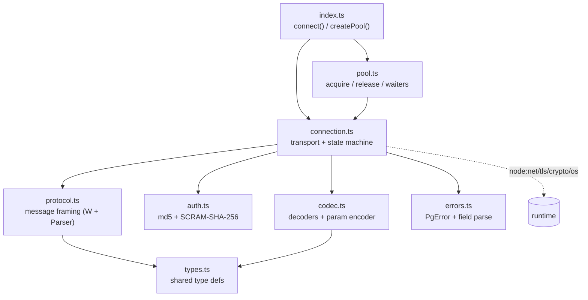

# minipg — design

A small, **pure-TypeScript** PostgreSQL driver for **queries only**: plain SQL strings + positional params, named prepared statements, pluggable result modes, and a single connection or a pool. Informed by the issue clustering (`ISSUE_CLUSTERS_AND_TEST_SUITE.md`) and source study (`ARCHITECTURE_AND_FLOWS.md`, `RUNTIME_DEPENDENCIES.md`) of postgres.js and node-postgres.

Status: implemented in `src/`, **typechecks clean** under the repo's strict tsconfig, and **passes 15/15** end-to-end checks against real PostgreSQL (`test/smoke.ts`), including md5 + SCRAM auth.

## Goals / non-goals

**Goals**
- Pure JS/TS, zero runtime deps — only `node:net` / `node:tls` / `node:crypto` / `node:os`.
- Plain `query(sql, params, opts)` — **no `sql\`\`` template tag.**
- Positional `$1` params; values as `unknown[]`.
- Named prepared statements (parse-once, bind-many) via `{ name }`.
- Multiple result modes: `array` (`unknown[][]`), `object`, `buffer` (`(Buffer|null)[][]`), `raw` (`Buffer[]`), plus `stream()`.
- Single `Connection` **or** a `Pool`.
- Correctness first: precision-safe defaults, every terminal event settles a promise, connection recovers after a query error.

**Non-goals (explicitly dropped):** `sql\`\`` template literals; LISTEN/NOTIFY; COPY; logical replication; server-side cursors; an ORM/query-builder. (Streaming is provided by emitting `DataRow`s incrementally, not via server portals.)

## Module architecture



Layering mirrors the cleaner half of node-postgres (a framing layer separate from I/O) but without EventEmitter fan-out — the connection drives a simple task queue with direct callbacks.

## Public API

```ts
const db = await connect({ host, port, user, password, database, ssl })

await db.query(sql, params?, { mode?, name? })   // Promise<QueryResult<Row>>
db.stream<Row>(sql, params?, { mode?, name?, highWaterMark? })  // AsyncIterableIterator<Row>
await db.end()

const pool = createPool({ ...config, max: 10 })
await pool.query(sql, params?, opts?)
const { client, release } = await pool.connect()  // dedicated conn for a transaction
await pool.end()
```

`QueryResult` = `{ rows, columns: string[], rowCount: number|null, command: string|null }`.
`query()` is overloaded so the row type follows `mode`.

### Result modes

| mode | row shape | decoding | use |
|---|---|---|---|
| `array` (default) | `unknown[]` | values decoded per OID | normal reads |
| `object` | `Record<string,unknown>` | values decoded per OID | convenience |
| `buffer` | `(Buffer\|null)[]` | none — raw field bytes | custom/zero-copy decode |
| `raw` | `Buffer` (one per row) | none — raw `DataRow` body | passthrough / proxying |
| `stream()` | per-row (mode-shaped) | as above | large results, backpressure |

`stream()` applies **TCP backpressure**: it pauses the socket when the consumer falls `highWaterMark` rows behind and resumes on drain; an early `break` cancels and drains so the connection stays usable.

### Decoding policy (precision-safe by default)

Driven directly by the issue clusters. In `array`/`object` modes:

- **`int8`/bigint → string, `numeric` → string** (the most-reported silent-corruption footgun — no `2^53` loss).
- `int2`/`int4`/`oid`/`float4`/`float8` → number; `bool` → boolean; `json`/`jsonb` → parsed; `bytea` → `Buffer`.
- **timestamps/date/time → string** (tz/Date conversion is lossy; left to the caller).
- everything else → UTF-8 string.

Override per-OID:

```ts
const db = await connect({ ...cfg, types: { 20: BigInt /* int8 -> BigInt */ } })
```

### Params & safety

Extended protocol with `$1` placeholders. Encoding: `Buffer` → binary param; `Date` → ISO; `boolean` → `t`/`f`; object/array → `JSON.stringify`; else `String(v)`. **NUL bytes (`0x00`) in a param or in SQL text are rejected client-side** (PostgreSQL C-strings can't carry them) — another clustered footgun closed.

### Named prepared statements

`{ name }` → the driver sends `Parse`+`Describe` once, caches the statement's `RowDescription`, and on reuse sends only `Bind`+`Execute` (no re-parse). If the same `name` is reused with **different** SQL, it `Close`s and re-prepares. No name → unnamed extended-protocol query each call.

## Wire protocol — query flow

```mermaid
sequenceDiagram
  participant App
  participant C as Connection
  participant PG as PostgreSQL
  App->>C: query(sql, params, {name})
  Note over C: enqueue; run when ready (1 in flight)
  alt first use of name (or unnamed)
    C->>PG: Parse(name, sql)
    C->>PG: Describe(S, name)
  end
  C->>PG: Bind('', name, params)
  C->>PG: Execute('', 0)
  C->>PG: Sync
  PG-->>C: ParseComplete / ParameterDescription
  PG-->>C: RowDescription (cached for named)
  loop each row
    PG-->>C: DataRow  --> shaped by mode
  end
  PG-->>C: CommandComplete (command, rowCount)
  PG-->>C: ReadyForQuery
  C-->>App: resolve QueryResult / next stream row
```

## Auth, SSL, lifecycle

- **Auth:** cleartext, md5, and **SCRAM-SHA-256** (SASL). SCRAM applies **SASLprep (NFKC)** — fixing the silent `28P01` on non-ASCII passwords that postgres.js has — caps PBKDF2 iterations (DoS guard), and verifies the server signature with `timingSafeEqual`. (Channel binding `-PLUS` is a documented next step.)
- **SSL:** `ssl: true | 'require'` (encrypt, no CA check) or an object passed straight to `tls.connect` (CA/verify); classic `SSLRequest` negotiation. `'require'` errors if the server refuses TLS.
- **Lifecycle invariants:** socket `error`/`close` rejects the in-flight query *and* every queued one (no hung promises); a query error (`ErrorResponse`) rejects with a `PgError` carrying SQLSTATE and the connection returns to `ready`. Verified by the smoke test.

## Runtime dependencies

| Module | Used for | When |
|---|---|---|
| `node:net` | TCP socket, `isIP` for SNI | always |
| `node:tls` | `tls.connect` upgrade | only with `ssl` |
| `node:crypto` | md5, SCRAM (pbkdf2/hmac/sha256/randomBytes) | only during auth |
| `node:os` | default username | config time (try/catch fallback) |

A pure-JS surface like this is portable to Bun unchanged; Deno/Workers would need socket shims (per `RUNTIME_DEPENDENCIES.md`), which the layering keeps localized to `connection.ts`.

## Testing

```bash
bun run test:setup   # initdb + start throwaway PG on :54329 (scram + md5 users, sample data)
bun run test         # runs test/smoke.ts — 15 checks  (use `bun run test`, not `bun test`)
bun run typecheck    # tsc --noEmit (strict)
```

## Roadmap (mapped to the P0 list in ISSUE_CLUSTERS_AND_TEST_SUITE.md)

Covered now: connection/auth/ssl, extended-protocol params, results & metadata, prepared statements, pooling basics, error recovery, NUL/precision footguns.

Next, in priority order:
1. **Timeouts & cancellation** — connect timeout exists; add per-query timeout + `AbortSignal` + a `CancelRequest` (out-of-band) path.
2. **Transactions helper** — `pool.connect()` already gives a dedicated client; add `begin/commit/rollback` sugar + pooled session-state reset on release.
3. **Binary result format** — opt-in per query for the hot types (the type-matrix test the gap analysis recommends).
4. **TLS verify modes** — explicit `verify-ca` / `verify-full` semantics.
5. **More type decoders** — arrays, uuid, timestamptz→Date opt-in (all overridable today).
6. **The "all-common-types round-trip matrix"** smoke test from the gap analysis.
